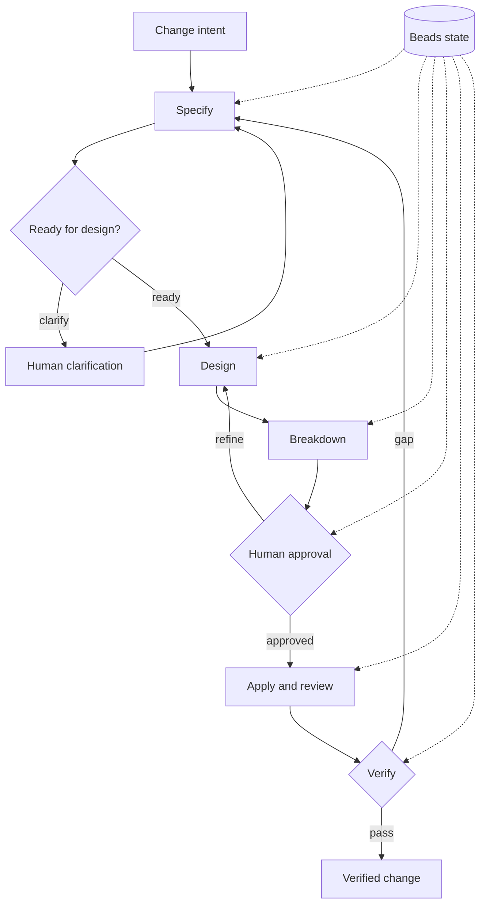
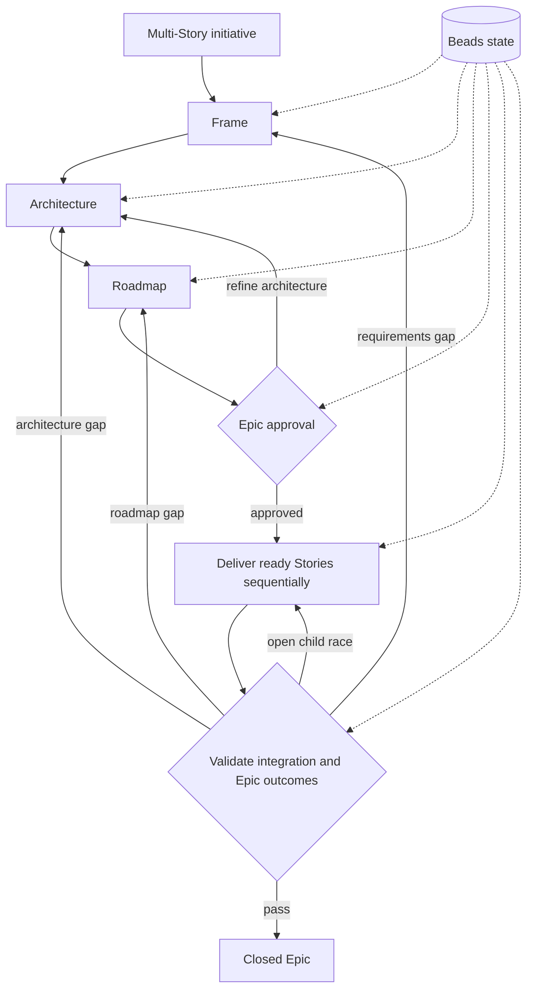

# Prism

**Turn ambiguous software-change requests into durable, reviewable delivery.**

Prism stores requirements, design, dependencies, approval, implementation, and
verification state in [Beads](https://github.com/gastownhall/beads). It ships as
three independent plugins, listed in their intended priority order.

## Plugins

| Priority | Plugin | Purpose | Primary entrypoint |
| --- | --- | --- | --- |
| 1 | **prism** | Primary host-native Story and Epic lifecycles | `$prism:lifecycle` |
| 2 | **prism-callee** | Story and Epic workflows executed through specialized Callee subagents | `$prism-callee:lifecycle` |
| 3 | **prism-light** | Concise host-native Story lifecycle | `$prism-light:lifecycle` |

The plugins share Beads state but have separate manifests, skill inventories,
marketplace entries, and runtime ownership. Installing one does not implicitly
install either of the others.

### 1. Prism host

The primary `prism` plugin owns the type-aware router, the full Story lifecycle,
and the Epic lifecycle. It never selects Prism Light or Callee implicitly.

| Workflow | Codex | Claude Code | Flat-slash hosts |
| --- | --- | --- | --- |
| Router and Epic batches | `$prism:lifecycle` | `/prism:lifecycle` | `/prism-lifecycle` |
| Full Story | `$prism:story` | `/prism:story` | `/prism-story` |
| Epic | `$prism:epic` | `/prism:epic` | `/prism-epic` |

An explicit request to process all open Prism epics snapshots them once, orders
them by priority, creation time, and ID, advances each sequentially, and reports
every outcome.

### 2. Prism Callee

`prism-callee` runs Story or Epic work through the canonical
[`prism/*`](pack/callee/prism) Callee agent pack. Specialized Role, Script,
Human, Sequential, Loop, and Router agents own phase-specific work.

| Codex | Claude Code | Flat-slash hosts |
| --- | --- | --- |
| `$prism-callee:lifecycle` | `/prism-callee:lifecycle` | `/prism-callee-lifecycle` |

Invoke the plugin with an ordinary request:

```text
$prism-callee:lifecycle Add CSV export to the report page.
```

The host resolves Beads state and builds the internal route envelope before
calling Callee; users do not construct that protocol manually.
Before execution, the default Callee catalog must contain `prism/lifecycle` as
a Router plus the `prism/story` and `prism/epic` imported roots.

### 3. Prism Light

`prism-light` owns the concise host-only Story workflow. Its canonical skill is
named `lifecycle`; the flat alias remains `prism-light`.

| Codex | Claude Code | Flat-slash hosts |
| --- | --- | --- |
| `$prism-light:lifecycle` | `/prism-light:lifecycle` | `/prism-light` |

Light is always explicit and is never selected by the primary Prism router.

## Story lifecycle



Story phases are:

1. `phase:story:specify`
2. `phase:story:design`
3. `phase:story:breakdown`
4. `phase:story:human`
5. `phase:story:apply`
6. `phase:story:verify`

## Epic lifecycle



Epic phases are:

1. `phase:epic:frame`
2. `phase:epic:architecture`
3. `phase:epic:roadmap`
4. `phase:epic:approval`
5. `phase:epic:delivery`
6. `phase:epic:validation`

Prism evaluates Story and Epic child graphs qualitatively: coverage, cohesion,
reviewability, verification, and necessary acyclic dependencies matter. There
is no fixed child-count range. Epic children are Stories; Story children are
Tasks. Nested Epics and direct Epic Tasks are invalid.

The full host plugin presents Design summary → Task summary → Approval request
for Stories and Architecture summary → Story roadmap → Approval request for
Epics. It shows acceptance criteria only when the operator explicitly requests
the current item's criteria. Prism Light retains its concise approval contract.
Every Apply transition still requires explicit human authorization.

## Quick start

Each public plugin accepts an ordinary request:

```text
$prism:lifecycle Add CSV export to the report page.
$prism-callee:lifecycle Add CSV export to the report page.
$prism-light:lifecycle Add CSV export to the report page.
```

Run only the entrypoint for the workflow you installed and want to use.

## Requirements

All three plugins require:

- [`bd` (Beads)](https://github.com/gastownhall/beads)
- a supported host

Prism Callee additionally requires:

- `callee` `0.19.0` or a compatible Router-capable release
- the `prism/*` agent pack

## Installation

Install plugins individually in priority order according to the workflows you
want to expose.

### Codex

```sh
codex plugin marketplace add baldaworks/prism
codex plugin add prism@prism
codex plugin add prism-callee@prism
codex plugin add prism-light@prism
```

To refresh an existing Git marketplace snapshot, run
`codex plugin marketplace upgrade prism`, then repeat `codex plugin add` for
the plugins you use. Start a new thread after a plugin reinstall.

### Claude Code

```sh
claude plugin marketplace add baldaworks/prism
claude plugin install prism@prism --scope user
claude plugin install prism-callee@prism --scope user
claude plugin install prism-light@prism --scope user
```

### Grok Build

```sh
grok plugin install 'baldaworks/prism#plugins/prism' --trust
grok plugin install 'baldaworks/prism#plugins/prism-callee' --trust
grok plugin install 'baldaworks/prism#plugins/prism-light' --trust
```

### GitHub Copilot CLI

```sh
copilot plugin marketplace add baldaworks/prism
copilot plugin install prism@prism
copilot plugin install prism-callee@prism
copilot plugin install prism-light@prism
```

### Cursor

```sh
agent plugin marketplace add https://github.com/baldaworks/prism.git
```

Install **prism**, **prism-callee**, and **prism-light** independently from the
marketplace UI.

### OpenCode and compatible flat-skill hosts

```sh
mkdir -p .opencode/skills
cp -a plugins/prism/prefixed-skills/prism-lifecycle .opencode/skills/
cp -a plugins/prism/prefixed-skills/prism-story .opencode/skills/
cp -a plugins/prism/prefixed-skills/prism-epic .opencode/skills/
cp -a plugins/prism-callee/prefixed-skills/prism-callee-lifecycle .opencode/skills/
cp -a plugins/prism-light/prefixed-skills/prism-light .opencode/skills/
```

## Install or update the Callee agents

This step is required only for `prism-callee` and direct Callee execution:

Initial import:

```sh
callee agent import baldaworks/prism \
  --path pack/callee/prism \
  --prefix prism
```

Update or repair an existing import:

```sh
callee agent import baldaworks/prism \
  --path pack/callee/prism \
  --prefix prism \
  --force
```

Validate the default catalog:

```sh
callee agent list | grep '^prism/'
callee agent view prism/lifecycle --json
callee agent view prism/story --json
callee agent view prism/epic --json
bd where
```

The lifecycle view must report kind `Router`. A `Sequential` lifecycle or a
missing Story/Epic root means the local import is stale; rerun the `--force`
command before using Prism Callee. `--agent-root pack/callee` is for repository
maintenance only and is not a runtime workaround.

## Repository ownership

| Path | Ownership |
| --- | --- |
| `plugins/prism/` | Primary host router, Story, and Epic skills |
| `plugins/prism-callee/` | Host integration for Callee-backed Story and Epic workflows |
| `plugins/prism-light/` | Concise host Story lifecycle and flat Light alias |
| `pack/callee/prism/` | Digest-locked canonical Callee Router, Story, and Epic agents |

Canonical and flat host paths are behavioral mirrors:

- `plugins/prism/skills/{lifecycle,story,epic}` ↔ corresponding
  `plugins/prism/prefixed-skills/prism-*` trees
- `plugins/prism-callee/skills/lifecycle` ↔
  `plugins/prism-callee/prefixed-skills/prism-callee-lifecycle`
- `plugins/prism-light/skills/lifecycle` ↔
  `plugins/prism-light/prefixed-skills/prism-light`

## Validation

```sh
./scripts/validate-plugin-packaging.sh
./scripts/validate-lifecycle-ownership.sh
./scripts/validate-documentation.sh
./scripts/test-lifecycle-drift-detection.sh
./scripts/test-documentation-drift-detection.sh
./scripts/test-lifecycle-forward-contracts.sh
./scripts/test-callee-lifecycle-forward-contracts.sh
```

For repeatable PTY-backed Callee Human smoke tests:

```sh
./scripts/smoke-test-callee-human.sh questions
./scripts/smoke-test-callee-human.sh specify
```

## Maintainer docs

- [`docs/architecture-spec.md`](docs/architecture-spec.md) — repository architecture specification
- [`docs/architecture-host-lifecycle.md`](docs/architecture-host-lifecycle.md) — primary host router
- [`docs/architecture-story-lifecycle.md`](docs/architecture-story-lifecycle.md) — full Story behavior
- [`docs/architecture-epic-lifecycle.md`](docs/architecture-epic-lifecycle.md) — Epic behavior
- [`docs/architecture-callee-lifecycle.md`](docs/architecture-callee-lifecycle.md) — Callee integration
- [`docs/architecture-light-lifecycle.md`](docs/architecture-light-lifecycle.md) — Prism Light behavior
- [`docs/callee-lifecycle-smoke-test.md`](docs/callee-lifecycle-smoke-test.md) — PTY-backed Callee Human smoke tests
- [`docs/lifecycle-ownership.json`](docs/lifecycle-ownership.json) — machine-checked ownership and integrity

## Authority

- Only explicit human intent authorizes Apply.
- Prism never invents approval.
- Repository tasks are committed after successful verification; pushing and
  publishing require explicit human authority.

## License

MIT — see [LICENSE](LICENSE).
