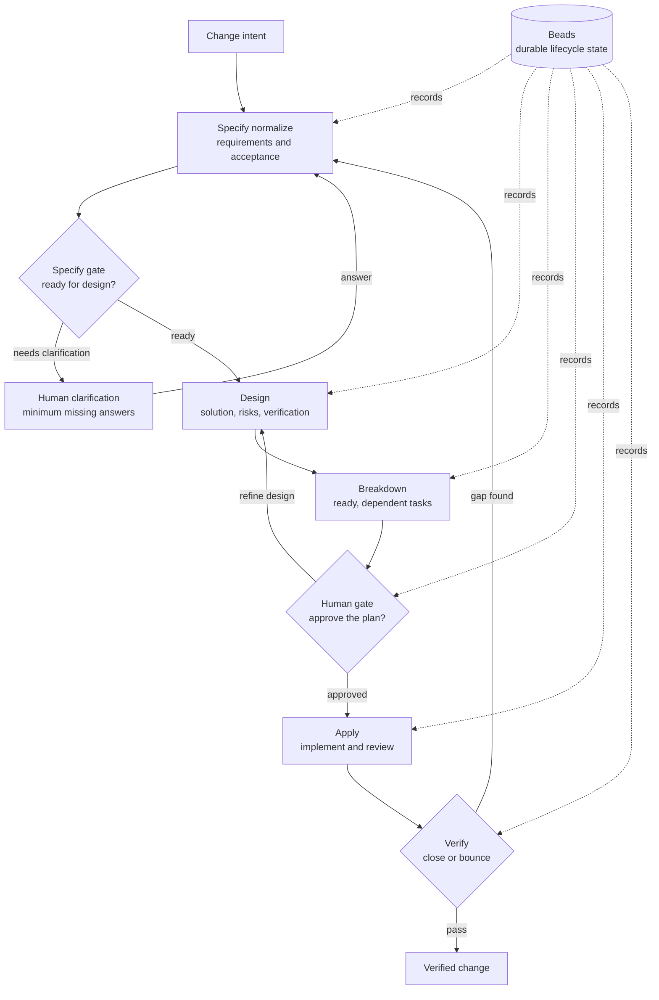
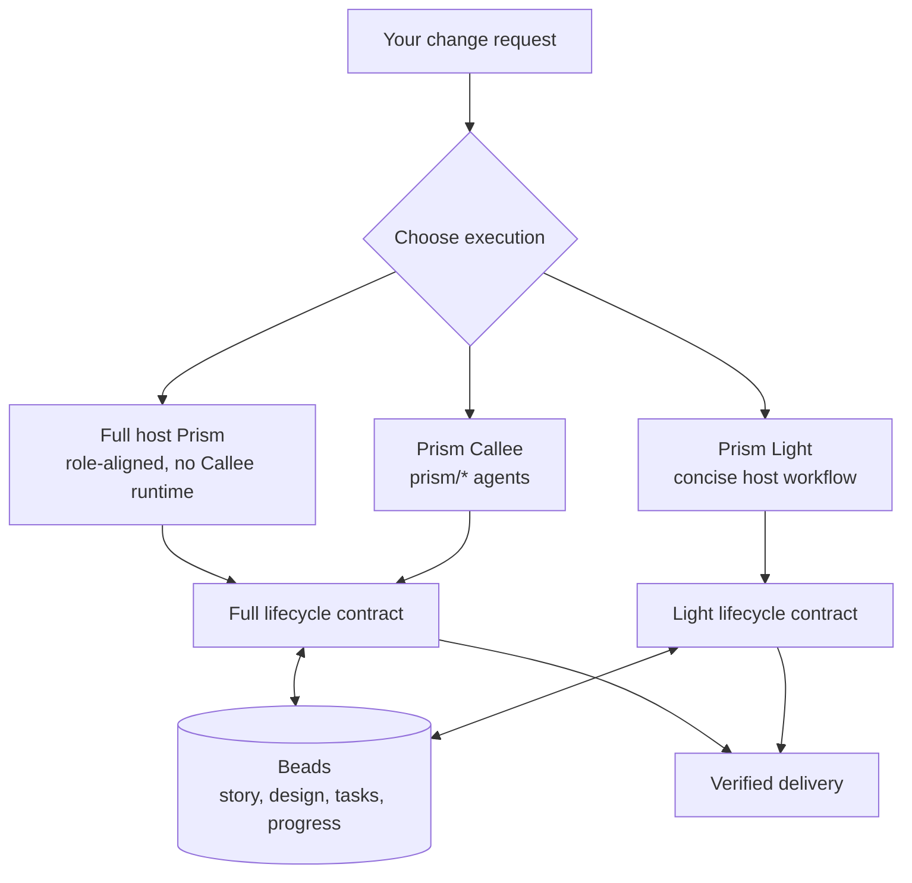

# Prism

**Turn an ambiguous software-change request into a durable, inspectable path
from intent to verified delivery.**

Prism is for developers and teams who want AI-assisted changes without losing
the reasoning, approval, or accountability between a request and the resulting
code. It gives every change an explicit lifecycle, keeps its state in Beads,
and requires informed human approval before implementation.

The result is a workflow you can inspect, resume, and verify instead of a chat
transcript that quietly becomes the project plan.

## From Intent to Verified Change



## Why Prism

- **Durable context.** Requirements, design, dependencies, decisions, and
  progress live in Beads rather than disappearing with a chat session.
- **Reviewable planning.** Design records the solution, relevant risks,
  tradeoffs, and verification before work is broken into tasks.
- **Explicit control.** A human reviews the design and task graph
  before implementation can begin.
- **Verified delivery.** Apply includes implementation and review; Verify
  closes only a complete story and sends gaps back to the right phase.

## Three Prism Execution Modes

All modes use the same Beads labels and durable story state. Full host Prism and
Prism Callee share the role-level contract from the immutable Callee pack.
Prism Light intentionally preserves the previous concise host workflow.



### Full Host Prism

The main Prism skill performs each Callee-aligned logical role directly in the
host without invoking Callee:

- Codex: `$prism:lifecycle`
- Claude Code: `/prism:lifecycle`
- Flat-slash hosts: `/prism-lifecycle`

Design runs explorer → architect, Apply runs implementer → independent reviewer,
and contract gates and iteration limits match the frozen Callee sources.

### Prism Light

Prism Light keeps the earlier concise host instructions:

- Codex: `$prism:light`
- Claude Code: `/prism:light`
- Flat-slash hosts: `/prism-light`

### Prism [Callee](https://github.com/baldaworks/callee) Workflow

Callee runs Markdown-defined agents and deterministic workflows. Prism Callee
expresses the same lifecycle as a workflow graph composed from specialized
`prism/*` subagents: Role agents for phase-specific reasoning, Script agents
for deterministic state transitions, a Human agent for approval, and
Sequential and Loop agents for orchestration. Each subagent can have settings
suited to its job, including its model, tools, and instructions.

Use its host entrypoint after installing the `prism-callee` plugin and agent
pack:

- Codex: `$prism-callee:lifecycle`
- Claude Code: `/prism-callee:lifecycle`
- Flat-slash hosts: `/prism-callee-lifecycle`

The same agent pack also supports direct binary execution:

```sh
callee agent run prism/lifecycle \
  --message "Add CSV export to the report page."
```

## Quick Start

After installing the host plugin, describe the change and run Prism:

```text
$prism:lifecycle Add CSV export to the report page.
```

Use `/prism:lifecycle` in Claude Code or `/prism-lifecycle` in flat-slash
hosts.

Use `$prism:light`, `/prism:light`, or `/prism-light` when you explicitly want
the previous concise host workflow.

Prism uses an explicitly named story when supplied, otherwise resumes exactly
one open Prism story. If neither applies, it creates a new Beads story from the
request and starts it with `phase:specify`.

To use the specialized `prism/*` workflow instead, install the Prism Callee
plugin and agent pack, then run `$prism-callee:lifecycle`,
`/prism-callee:lifecycle`, or `/prism-callee-lifecycle` for your host.

To run the same public workflow directly through the binary:

```sh
callee agent run prism/lifecycle \
  --message "Add CSV export to the report page."
```

## Before You Start

For the host-native lifecycle, you need:

- [`bd` (Beads)](https://github.com/gastownhall/beads)
- a supported host with the Prism plugin installed

For the Prism Callee workflow, you also need:

- `callee` `0.18.0+`
- the Prism Callee agent pack installed so `prism/*` appears on `callee agent list`

Prism therefore ships three host-facing execution paths:

1. **`prism:lifecycle`**, the full role-aligned host workflow.
2. **`prism:light`**, the concise host workflow in the same plugin.
3. The **`prism-callee` plugin**, which runs the lifecycle through the
   specialized `prism/*` workflow.

## Install the Host Plugin

### Codex

```sh
codex plugin marketplace add baldaworks/prism
codex plugin add prism@prism
# optional: only needed for the Prism Callee workflow
codex plugin add prism-callee@prism
```

Invoke with:

- `$prism:lifecycle` for the main lifecycle
- `$prism:light` for the concise host lifecycle
- `$prism-callee:lifecycle` for the Prism Callee workflow

### Claude Code

```sh
claude plugin marketplace add baldaworks/prism
claude plugin install prism@prism --scope user
# optional: only needed for the Prism Callee workflow
claude plugin install prism-callee@prism --scope user
```

Invoke with:

- `/prism:lifecycle` for the main host-native lifecycle
- `/prism:light` for the concise host lifecycle
- `/prism-callee:lifecycle` for the Prism Callee workflow after installing the
  Callee pack described below

### Grok Build

```sh
grok plugin install 'baldaworks/prism#plugins/prism' --trust
# optional: only needed for the Prism Callee workflow
grok plugin install 'baldaworks/prism#plugins/prism-callee' --trust
```

Invoke with:

- `/prism-lifecycle` for the main lifecycle
- `/prism-light` for the concise host lifecycle
- `/prism-callee-lifecycle` for the Prism Callee workflow

### GitHub Copilot CLI

```sh
copilot plugin marketplace add baldaworks/prism
copilot plugin install prism@prism
# optional: only needed for the Prism Callee workflow
copilot plugin install prism-callee@prism
```

### Cursor

```sh
agent plugin marketplace add https://github.com/baldaworks/prism.git
```

Then install **prism** and, if you want the Callee workflow, **prism-callee**
from the marketplace UI. Invoke `prism-lifecycle`, `prism-light`, or
`prism-callee-lifecycle`.

### OpenCode

OpenCode can load these skills directly from `.opencode/skills/`. If your setup
does not install them through another compatibility path, copy the shipped flat
skills:

```sh
mkdir -p .opencode/skills
cp -a plugins/prism/prefixed-skills/prism-lifecycle .opencode/skills/
cp -a plugins/prism/prefixed-skills/prism-light .opencode/skills/
# optional: only needed for the Prism Callee workflow
cp -a plugins/prism-callee/prefixed-skills/prism-callee-lifecycle .opencode/skills/
```

Invoke `prism-lifecycle` for full host execution, `prism-light` for the concise
host workflow, or `prism-callee-lifecycle` for the Callee workflow.

## Install the Callee Agents

Only required for the Prism Callee workflow entrypoints:
`$prism-callee:lifecycle`, `/prism-callee:lifecycle`, or
`/prism-callee-lifecycle`, regardless of which supported host invokes them.
The same agent installation is used for direct `callee agent run prism/...`
execution.

For most users, the right install path is:

```sh
callee agent import baldaworks/prism \
  --path pack/callee/prism \
  --prefix prism
```

Validate the install:

```sh
callee agent list | grep '^prism/'
callee agent view prism/lifecycle --json
bd where
```

## Lifecycle Summary

Prism stores one current phase at a time. A lifecycle invocation automatically
continues through successful pre-approval phases, enters the Human gate, and
presents its informed approval request:

1. `phase:specify`
2. `phase:design`
3. `phase:breakdown`
4. `phase:human`
5. `phase:apply`
6. `phase:verify`

Rules that matter to users:

- Full Design runs an evidence-backed explorer pass followed by a REQ-traceable
  architect pass. Full Breakdown preserves task traceability, complexity,
  dependencies, critical path, risks, verification, and rollback.
- Prism Light uses the previous concise Design and Breakdown instructions.
- A human must explicitly authorize apply. In the host lifecycle, ordinary
  free-form approval is enough for the host to persist `human:approved`; an
  explicit design-refinement request clears approval and returns the story to
  `phase:design`; an ambiguous response leaves the gate closed.
- Before approval, Prism shows Design summary → Task summary → Approval
  request. One informed approval covers the design and task graph.
- In the `prism-callee` workflow, a no-tools classifier interprets the
  Human agent's free-form response as approval, design refinement, or
  fail-closed withholding. A deterministic gate permits Apply only for
  approval and emits a machine-readable stop for refinement.
- Exactly one `phase:*` Beads story label is the current lifecycle phase.
- Story assignees do not encode lifecycle phases. Existing assignee-driven
  stories are not migrated or supported.
- Lifecycle creates a story when no explicit or uniquely resumable Prism story exists.
- Both host skills derive the current phase from Beads story state; neither
  exposes separate phase subskills.
- Apply closes remaining story work one ready child task at a time.
- Verify is a close-or-bounce story decision.
- `$prism:lifecycle`, `/prism:lifecycle`, and `/prism-lifecycle` perform the
  full role-aligned work directly in the host and never invoke Callee.
- `$prism:light`, `/prism:light`, and `/prism-light` perform the concise work
  directly in the host.
- `$prism-callee:lifecycle`, `/prism-callee:lifecycle`, and `/prism-callee-lifecycle` run `prism/*` Callee assets through the host integration.
- `callee agent run prism/lifecycle` runs the same public Callee graph directly.

For the formal split between full host, Light, and Callee behavior,
start with:

- `docs/architecture-spec.md`
- `docs/architecture-host-lifecycle.md`
- `docs/architecture-light-lifecycle.md`
- `docs/architecture-callee-lifecycle.md`

## When to Use Direct Callee Commands

Most users should use the normal host entrypoints:
`$prism:lifecycle`, `/prism:lifecycle`, `/prism-lifecycle`,
`$prism:light`, `/prism:light`, `/prism-light`,
`$prism-callee:lifecycle`, `/prism-callee:lifecycle`, or
`/prism-callee-lifecycle`.

Direct `callee agent run prism/...` commands are useful for:

- debugging the lifecycle
- validating a local Prism install
- advanced operator workflows

Run the full public workflow directly with:

```sh
callee agent run prism/lifecycle \
  --message "Add CSV export to the report page."
```

This direct command runs the Callee graph but does not persist or resume Beads
state. Use a `prism-callee` host entrypoint when host-managed Beads persistence
is required.

For ordinary host-integrated execution, the `prism-callee` skill entrypoints
remain available. Use `prism/phases/*` IDs when debugging or running an
individual phase.

If you want the full operational behavior, see:

- `docs/architecture-host-lifecycle.md` for the host-native lifecycle
- `docs/architecture-light-lifecycle.md` for Prism Light
- `docs/architecture-callee-lifecycle.md` for the `prism-callee` workflow

For repeatable PTY-backed smoke tests of the Callee Human path, use:

```sh
./scripts/smoke-test-callee-human.sh questions
./scripts/smoke-test-callee-human.sh specify
```

Use `--keep-temp` if you want the captured diagnostics and artifacts left under
`/tmp` for inspection.

The corresponding lifecycle sources are:

- `plugins/prism/skills/lifecycle/SKILL.md`
- `plugins/prism/skills/light/SKILL.md`
- `plugins/prism-callee/skills/lifecycle/SKILL.md`
- `pack/callee/prism/lifecycle.md`

## Repository Notes

If you are using this repository itself as a source checkout, these paths matter:

- `plugins/prism/` contains the full and Light host skill payloads.
- `plugins/prism-callee/` contains the Callee workflow lifecycle skill.
- `pack/callee/` is the immutable source of truth and must not be modified by
  host-skill adaptation work.
- `.callee/*` may exist as a local discovery mirror in this repo, but `pack/callee/*` remains authoritative.

The repository also publishes marketplace metadata for multiple hosts from the repo root.
The Codex and Claude plugin manifests for `prism` and `prism-callee`
should stay aligned except for host-native invocation syntax in prompts.

To validate host-plugin packaging parity after changing manifests or marketplace files, run:

```sh
./scripts/validate-plugin-packaging.sh
```

To validate the lifecycle ownership contract after changing phase, assignee, or
execution semantics, run:

```sh
./scripts/validate-lifecycle-ownership.sh
```

## Maintainer Docs

Start with the boundary docs:

- `docs/architecture-spec.md` for the repository-level boundary map
- `docs/architecture-host-lifecycle.md` for the host-native lifecycle
- `docs/architecture-light-lifecycle.md` for Prism Light
- `docs/architecture-callee-lifecycle.md` for the `prism-callee` workflow

Then use the execution-path-specific sources of truth for the path you are
editing:

- `plugins/prism/skills/lifecycle/SKILL.md`
- `plugins/prism/prefixed-skills/prism-lifecycle/SKILL.md`
- `plugins/prism/skills/lifecycle/references/lifecycle.md`
- `plugins/prism/skills/light/SKILL.md`
- `plugins/prism/prefixed-skills/prism-light/SKILL.md`
- `plugins/prism/skills/light/references/lifecycle.md`
- `plugins/prism-callee/skills/lifecycle/SKILL.md`
- `plugins/prism-callee/prefixed-skills/prism-callee-lifecycle/SKILL.md`
- `plugins/prism-callee/skills/lifecycle/references/promptkit.md`

## Authority

- Only explicit human intent authorizes apply. The host may persist
  `human:approved` on the human's behalf after unambiguous free-form approval.
- Prism should not invent approval.
- Commit and push require explicit human authority.

## License

MIT — see [LICENSE](LICENSE).
