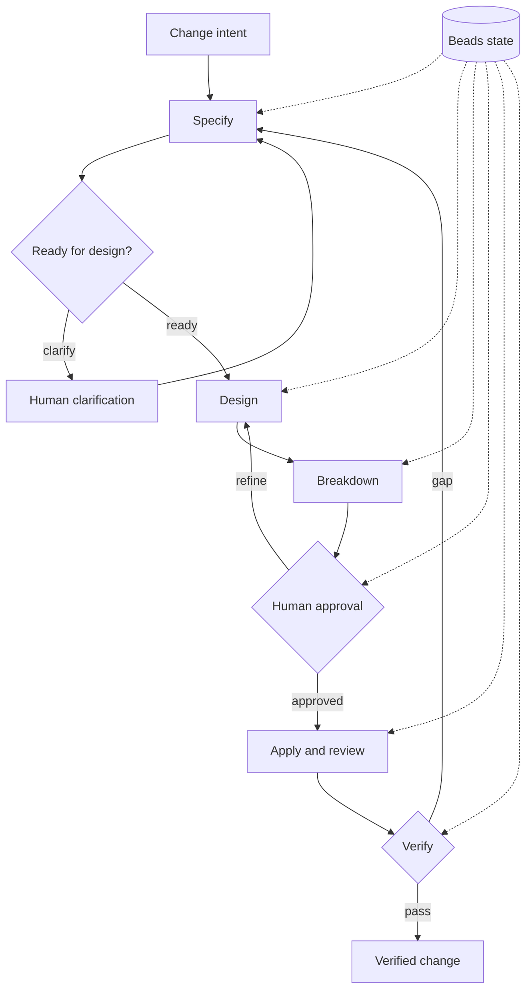
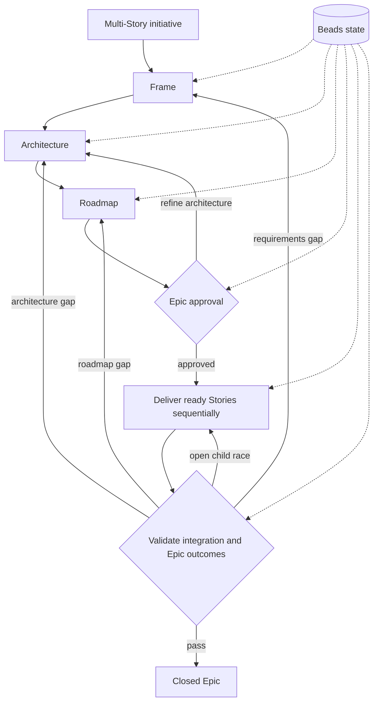

# Prism

Run `prism:story` with a change request and carry it from requirements and design
through reviewed implementation and verification in your coding agent.
Prism manages the phases: you do not need to choose a new command at each step.
It pauses for necessary clarification, your approval before implementation,
or a blocker. Saved state in [Beads](https://github.com/gastownhall/beads) lets
you resume the same Story across sessions.

## Quick start

```text
$prism:story Add CSV export to the report page.
```

Describe the outcome you want, refine the plan when asked, and approve it when
ready. Prism then implements, reviews and verifies the change.

For a larger initiative, use `prism:epic`. If you want Prism to select the
workflow, use the router:

```text
$prism:lifecycle Add CSV export to the report page.
```

| Workflow | Codex | Claude Code | Flat-slash coding agents |
| --- | --- | --- | --- |
| lifecycle | `$prism:lifecycle` | `/prism:lifecycle` | `/prism-lifecycle` |
| story | `$prism:story` | `/prism:story` | `/prism-story` |
| epic | `$prism:epic` | `/prism:epic` | `/prism-epic` |

## Requirements

- A supported coding agent and `bd` (Beads).
- Coding agent execution uses the bundled skills directly.

## Installation

### Codex

```sh
codex plugin marketplace add baldaworks/prism
codex plugin add prism@prism
```

Refresh using `codex plugin marketplace upgrade prism`, repeat the plugin
add command, and start a new thread.

### Claude Code

```sh
claude plugin marketplace add baldaworks/prism
claude plugin install prism@prism --scope user
```

### Grok Build

```sh
grok plugin install 'baldaworks/prism#plugins/prism' --trust
```

### GitHub Copilot CLI

```sh
copilot plugin marketplace add baldaworks/prism
copilot plugin install prism@prism
```

### Cursor

```sh
agent plugin marketplace add https://github.com/baldaworks/prism.git
```

Install **prism** from the marketplace UI.

### OpenCode and compatible flat-skill coding agents

From this checkout:

```sh
mkdir -p .opencode/skills .opencode/commands
cp -a plugins/prism/prefixed-skills/prism-lifecycle .opencode/skills/
cp plugins/prism/prefixed-commands/prism-lifecycle.md .opencode/commands/
cp -a plugins/prism/prefixed-skills/prism-story .opencode/skills/
cp plugins/prism/prefixed-commands/prism-story.md .opencode/commands/
cp -a plugins/prism/prefixed-skills/prism-epic .opencode/skills/
cp plugins/prism/prefixed-commands/prism-epic.md .opencode/commands/
```

Commands are optional thin wrappers that load the corresponding skill.

### Agent Plugins 1.0.0

The portable package root is `plugins/prism/`; clients discover its immediate
child skills under `skills/`. Use your client's installation workflow.

## Story lifecycle



Story phases are:

1. `phase:story:specify`
2. `phase:story:design`
3. `phase:story:breakdown`
4. `phase:story:human`
5. `phase:story:apply`
6. `phase:story:verify`

## Epic lifecycle



Epic phases are:

1. `phase:epic:frame`
2. `phase:epic:architecture`
3. `phase:epic:roadmap`
4. `phase:epic:approval`
5. `phase:epic:delivery`
6. `phase:epic:validation`

Prism evaluates Story and Epic child graphs qualitatively: coverage, cohesion,
reviewability, verification, and necessary acyclic dependencies matter. There
is no fixed child-count range. Epic children are Stories; Story children are
Tasks. Nested Epics and direct Epic Tasks are invalid.

The full coding agent plugin presents Design summary → Task summary → Approval request
for Stories and Architecture summary → Story roadmap → Approval request for
Epics. It shows acceptance criteria only when the operator explicitly requests
the current item's criteria. Every Apply transition still requires explicit
human authorization.

## Learn more

- [Prism, OpenSpec and BMAD](docs/comparison.md): workflow, skill counts, Git teamwork, durability and validation.
- [Teams, saved state and recovery](docs/team-workflow.md): share work and resume safely across people and sessions.
- [Architecture](docs/architecture-spec.md), [coding agent router](docs/architecture-host-lifecycle.md), [Story](docs/architecture-story-lifecycle.md), and [Epic](docs/architecture-epic-lifecycle.md): lifecycle contracts in detail.
- [Contributing](CONTRIBUTING.md): maintaining and validating Prism.

## Optional integration

The separately maintained [Prism Callee repository](https://github.com/baldaworks/prism-callee)
provides the optional Callee integration and agent pack. For the coding agent
workflow above, no Callee installation is required. Installing either plugin
does not install the other.

### Migration from the combined repository

Existing `prism@prism` installs retain their identity. Refresh the marketplace
and reinstall to obtain the primary coding agent package. Callee users must
move to the linked Prism Callee repository; its plugin and agent pack are no
longer distributed here. Public invocation names and existing Beads labels
remain compatible.

## License

MIT — see [LICENSE](LICENSE).
