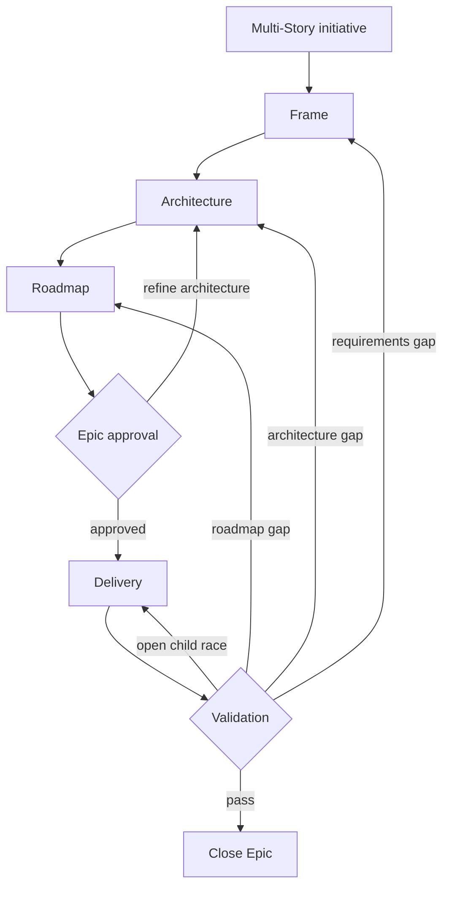
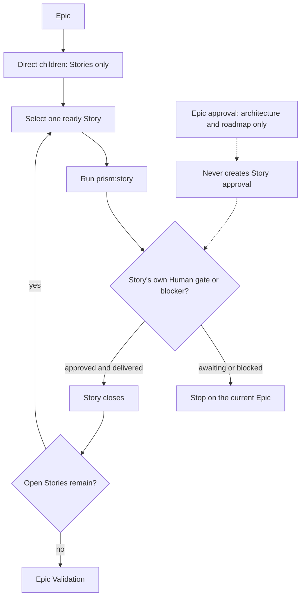

# Epic Lifecycle

`prism:epic` is the host-native lifecycle for one multi-Story Beads Epic. Its
hierarchy is strict: Epic → Story → Task. Nested Epics and Tasks directly under
an Epic are invalid.

## State machine

An active Epic has exactly one supported phase label:

1. `phase:epic:frame`
2. `phase:epic:architecture`
3. `phase:epic:roadmap`
4. `phase:epic:approval`
5. `phase:epic:delivery`
6. `phase:epic:validation`

Unsupported phase labels are treated as absent and are never migrated. An Epic
with no supported Epic phase starts at Frame and clears stale Epic approval.
Labels from another supported item namespace fail closed.

## Gates and children

Frame establishes the Epic acceptance criteria. Architecture defines shared
boundaries and cross-Story risks. Roadmap creates or reconciles Story children
using qualitative coverage, cohesion, independent reviewability, verification,
and dependency correctness. There is no child-count limit.

Before requesting Epic approval, the host shows this exact order:

1. Architecture summary;
2. Story roadmap;
3. Approval request.

Acceptance remains a required internal gate input, but the host shows it only
when the operator explicitly requests the current Epic criteria.

Epic approval authorizes only the architecture and roadmap. It never approves
implementation of a child Story. Delivery advances eligible Stories
sequentially through `prism:story`; each Story retains its own human gate.
Validation closes the Epic only after its acceptance criteria and child Story
outcomes are verified.

### Sequential delivery and approval scope

When called by router batch mode, the Epic lifecycle advances only that Epic to
its next genuine stop. Item-local gates and blockers are returned as outcomes
so the router can continue the snapshot.

## Sources

| Surface | Source |
| --- | --- |
| Namespaced | `plugins/prism/skills/epic/` |
| Flat | `plugins/prism/prefixed-skills/prism-epic/` |

These two trees are behavioral mirrors and are covered by the ownership
validator.
