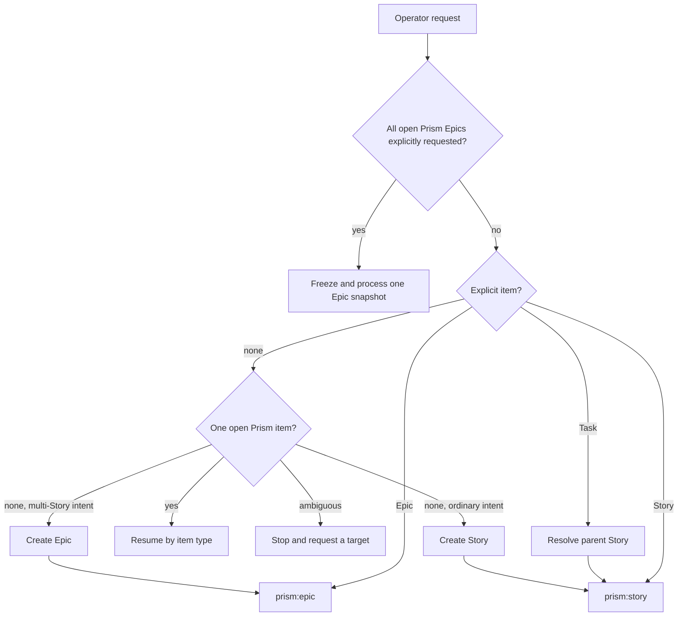
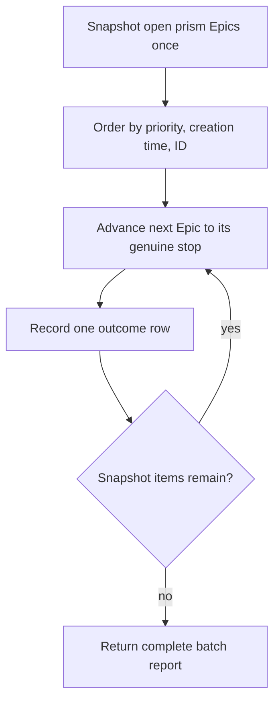

# Host Lifecycle Router

`prism:lifecycle` is the default host-native entrypoint. It resolves a target
and delegates to `prism:story` or `prism:epic`; it is not a third item
lifecycle and never selects Prism Callee or Prism Light implicitly.

## Routing

Explicit item IDs win over inferred intent. Unsupported item types, invalid
Task parentage, wrong-type lifecycle phases, and ambiguous resume candidates
fail closed without inventing a target.

## Open-Epic batch

Batch mode runs only on an explicit request to process all open Prism Epics.

The router visits every snapshotted Epic exactly once and sequentially. It
continues after item-local approval gates, clarification, blockers, and
failures; it never rescans for newly opened Epics. Approval never transfers
between Epics or to a child Story. An empty snapshot is a successful no-work
result.

## Sources

| Surface | Source |
| --- | --- |
| Namespaced router | `plugins/prism/skills/lifecycle/` |
| Flat router | `plugins/prism/prefixed-skills/prism-lifecycle/` |
| Story lifecycle | `plugins/prism/skills/story/` |
| Epic lifecycle | `plugins/prism/skills/epic/` |

The canonical and flat router trees are behavioral mirrors enforced by
`scripts/validate-lifecycle-ownership.sh`.
