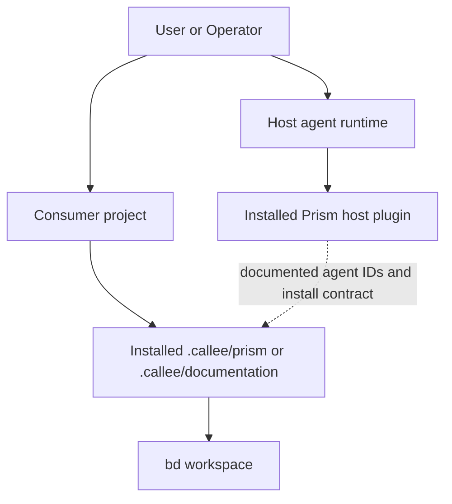
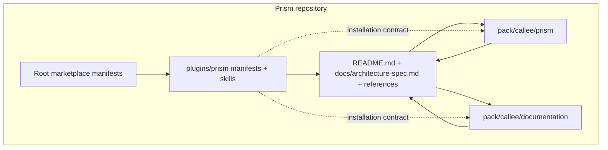

# Prism — Architecture Specification

## 1. Introduction
KNOWN: This repository packages one host plugin at `plugins/prism/`, one Prism story-lifecycle Callee pack at `pack/callee/prism/`, and one repository-documentation Callee pack at `pack/callee/documentation/` (`README.md`, `plugins/prism/skills/lifecycle/SKILL.md`, `pack/callee/documentation/workflows/maintain.md`). KNOWN: The repository exists to distribute a Beads-backed story lifecycle and a separate documentation-maintenance workflow through host plugin manifests and reusable Callee packs.

KNOWN: The primary user-facing capability is the Prism lifecycle skill, invoked as `$prism:lifecycle` on namespaced hosts or `/prism-lifecycle` on flat-slash hosts, which advances stories through specify, design, breakdown, a human `approved` gate, apply, and verify (`plugins/prism/skills/lifecycle/SKILL.md`, `plugins/prism/skills/lifecycle/references/lifecycle.md`). KNOWN: A second capability is the `documentation/workflows/maintain` loop, which uses a writer/reviewer pair to keep repository documentation aligned with the live working tree and explicitly requires the vertical lifecycle workflow requirement when lifecycle behavior is documented (`pack/callee/documentation/workflows/maintain.md`).

## 2. Definitions
| Term | Definition |
| --- | --- |
| Beads | The external issue tracker/CLI (`bd`) used as the durable state store for stories, design notes, child tasks, dependencies, labels, and progress. |
| Callee | The external agent runner that executes Roles and Sequential/Loop workflows defined in this repository. |
| Host plugin | The plugin payload under `plugins/prism/` plus per-host plugin manifests used by agent hosts to expose Prism skills. |
| Marketplace manifest | A root-level JSON file that exposes this repository as an installable marketplace source for a host. |
| Prism lifecycle | The story workflow defined by the Prism skill and Callee pack: specify, design, breakdown, human approval, apply, and verify. |
| Vertical lifecycle workflow requirement | The documentation rule that lifecycle/workflow diagrams and descriptions must preserve a top-to-bottom progression; Mermaid diagrams use `flowchart TB`. |
| Documentation pack | The Callee pack under `pack/callee/documentation/` that runs the documentation writer/reviewer maintenance loop. |
| Namespaced skill | A host skill exposed from `plugins/prism/skills/lifecycle/`, invoked as `$prism:lifecycle`. |
| Prefixed skill | A host skill exposed from `plugins/prism/prefixed-skills/prism-lifecycle/`, invoked as `/prism-lifecycle`. |
| `.callee` mirror | A repository-local symlink or copy of `pack/callee/*` used for local Callee discovery when present; `pack/callee/*` remains authoritative. |

## 3. Architectural Scope
KNOWN: This architecture covers the repository contents that define and distribute Prism behavior: the host plugin payload under `plugins/prism/`, the Prism Callee pack under `pack/callee/prism/`, the documentation Callee pack under `pack/callee/documentation/`, the checked-in `.callee/*` discovery mirror, and the root marketplace manifests under `.agents/plugins/`, `.claude-plugin/`, `.cursor-plugin/`, `.github/plugin/`, and `.grok-plugin/`.

KNOWN: Covered deployment modes are repository consumption as a host-plugin marketplace source and repository consumption as a Callee pack copied or linked into another project as `.callee/prism/` or `.callee/documentation/` (`README.md`, `plugins/prism/skills/lifecycle/SKILL.md`).

KNOWN: The live working tree currently contains `.callee/prism/` and `.callee/documentation/`, and those paths are local mirrors of `pack/callee/*` rather than additional authoritative sources (`README.md`, `.gitignore`).

INFERRED: Out of scope are the internal implementations of the external `bd` and `callee` binaries, host-specific runtime behavior beyond the repository manifests and skill files in the live working tree, and any consumer-project application code that Prism may later operate on. This is inferred because the repository contains configuration, skill, and workflow definitions rather than those upstream runtimes.

## 4. Assumptions and Limitations
- [ASSUMPTION][Temporary] No separate operator runbook exists outside `README.md` and this architecture specification. This is reasonable because repository inspection found no other operator-focused docs in the working tree root, `docs/`, or `pack/`.
- KNOWN[Permanent]: The repository currently ships one Prism skill today, even though the plugin layout allows more skills under `plugins/prism/skills/` (`README.md`, `plugins/prism/skills/`).
- KNOWN[Permanent]: The documentation maintenance workflow is a separate pack and is not part of the Beads phase machine for Prism stories (`README.md`, `pack/callee/documentation/workflows/maintain.md`).
- KNOWN[Permanent]: The apply phase cannot be automated end-to-end because a human must set the `approved` label before `prism/workflows/apply` is allowed to run (`plugins/prism/skills/lifecycle/SKILL.md`, `plugins/prism/skills/lifecycle/references/lifecycle.md`).
- KNOWN[Permanent]: `pack/callee/prism/` and `pack/callee/documentation/` are the authoritative workflow definitions; a repository-local `.callee/*` tree is only a discovery mirror when present (`README.md`, `.gitignore`).
- [ASSUMPTION][Temporary] Contact ownership is not documented in the repository, so Section 7 uses `[UNKNOWN]` placeholders rather than inferred names. This is necessary to avoid fabricating maintainers.
- KNOWN[Permanent]: **Examined**: `README.md`, `docs/architecture-spec.md`, `.callee/`, `plugins/prism/`, `pack/callee/`, root marketplace manifests, and workflow/reference markdown under those paths. **Method**: repository file enumeration with `rg --files` and `find`, targeted reads with `sed`, search with `rg -n` over workflow and lifecycle terms, and mirror verification with `diff -rq` between `.callee/*` and `pack/callee/*`.
- KNOWN[Permanent]: **Excluded**: external implementations of `bd`, `callee`, and host runtimes, plus any consumer-project repository that would install `.callee/prism/` or `.callee/documentation/`. These are excluded because they are not defined in this repository.
- KNOWN[Temporary]: **Limitations**: this maintenance pass verified repository files in the live working tree and repository layout only; it did not execute external CLIs or perform host-runtime installs from the repository during authorship.

## 5. Architecture Description

### 5.1 Protocol / System Description
KNOWN: This repository does not implement a wire protocol. It defines a repository-local control system made of skills, Roles, and workflows that orchestrate two external systems: Beads for durable state and Callee for agent execution.

#### 5.1.1 Prism story lifecycle
KNOWN: The Prism lifecycle advances one phase at a time and uses Beads as the durable source of truth while Callee runs stateless agent work under `prism/*` (`plugins/prism/skills/lifecycle/references/lifecycle.md`). KNOWN: The ordered steps are intake, specify, design, breakdown, human gate, apply, verify, and close story. KNOWN: The repository requires lifecycle documentation to preserve that order as a vertical top-to-bottom flow.

#### 5.1.2 Documentation maintenance lifecycle
KNOWN: The documentation pack defines a Loop workflow named `documentation/workflows/maintain` whose children are `documentation/roles/writer` and `documentation/roles/reviewer` (`pack/callee/documentation/workflows/maintain.md`). KNOWN: The writer is instructed to inspect the live repository and update docs to match verified behavior, and the reviewer is instructed to audit that output against the live working tree. KNOWN: The workflow explicitly includes the vertical lifecycle workflow requirement in both writer requirements and reviewer focus areas.

#### 5.1.3 Packaging model
KNOWN: The repository separates host-facing plugin assets from project-facing Callee pack assets. KNOWN: Host-specific plugin manifests live under `plugins/prism/.codex-plugin/`, `plugins/prism/.claude-plugin/`, `plugins/prism/.cursor-plugin/`, `plugins/prism/.grok-plugin/`, and `plugins/prism/.plugin/`, while project-facing workflows and Roles live under `pack/callee/...` (`plugins/prism/.codex-plugin/plugin.json`, `plugins/prism/.claude-plugin/plugin.json`, `plugins/prism/.cursor-plugin/plugin.json`, `plugins/prism/.grok-plugin/plugin.json`, `plugins/prism/.plugin/plugin.json`).
KNOWN: Installing the host plugin does not install `.callee/prism/` or `.callee/documentation/` automatically; operators must copy or link those packs into consumer projects separately (`README.md`, `plugins/prism/skills/lifecycle/SKILL.md`).
KNOWN: The live working tree carries `.callee/prism/` and `.callee/documentation/` as a local mirror for Callee discovery, but those paths are derivative of `pack/callee/*` and should not be edited as the primary source (`README.md`, `.gitignore`).

### 5.2 Network Architecture
INFERRED: Not applicable — this repository operates as local documentation, manifest, and workflow content. The repository files in the live working tree describe installation sources and external CLIs, but the repository itself does not run a resident network service.

KNOWN: The external entities referenced by the repository are agent hosts, Callee, and Beads. KNOWN: The host plugin and the Callee packs are separate installed artifacts that share naming and workflow contracts but are documented as separate installation steps (`README.md`, `plugins/prism/skills/lifecycle/SKILL.md`). INFERRED: DNS, load balancers, NAT, and firewall behavior are out of architectural scope because no repository component in this working tree defines or configures them.

### 5.3 Software Architecture

KNOWN: The root marketplace manifests advertise the repository or plugin to host ecosystems. KNOWN: The `plugins/prism/` subtree contains the reusable host plugin content. KNOWN: The `pack/callee/prism/` subtree defines six Roles and three workflows for the story lifecycle, and `pack/callee/documentation/` defines two Roles and one maintenance workflow (`README.md`, `plugins/prism/skills/lifecycle/references/promptkit.md`, `pack/callee/documentation/workflows/maintain.md`).

#### 5.3.1 Production components
- KNOWN: `plugins/prism/skills/lifecycle/SKILL.md` is the canonical namespaced skill body for hosts that support namespaced skills.
- KNOWN: `plugins/prism/prefixed-skills/prism-lifecycle/SKILL.md` is the flat-slash variant for hosts that consume prefixed skill layouts.
- KNOWN: `pack/callee/prism/workflows/design.md`, `apply.md`, and `verify.md` define the Prism lifecycle execution graph.
- KNOWN: `pack/callee/documentation/workflows/maintain.md` defines the documentation maintenance execution graph.

#### 5.3.2 Test and validation components
- KNOWN: The repository docs instruct maintainers to use `callee agent validate` and `callee agent view ... --json` to validate Role and workflow definitions after regeneration or installation (`README.md`, `plugins/prism/skills/lifecycle/references/promptkit.md`).
- INFERRED: Validation is documentation-driven rather than enforced by a repository-local automated test suite, because repository inspection found workflow and documentation files but no dedicated test harness files.

### 5.4 Programming Interfaces
- KNOWN: The primary public interface is the host skill invocation surface: `$prism:lifecycle` for namespaced hosts and `/prism-lifecycle` for flat-slash hosts (`README.md`, `plugins/prism/skills/lifecycle/SKILL.md`).
- KNOWN: The secondary public interface is the Callee agent surface exposed after a consumer project installs the packs: `prism/roles/*`, `prism/workflows/*`, and `documentation/workflows/maintain` (`README.md`).
- KNOWN: Invocation shape is CLI-based rather than RPC- or REST-based. The repository documents commands such as `callee agent run ...`, `callee agent validate ...`, `bd create`, `bd update`, and `bd close`.
- KNOWN: The `prism/workflows/apply` interface requires prior human authorization through the `approved` story label before use (`plugins/prism/skills/lifecycle/SKILL.md`).
- INFERRED: Extensibility is file-system based: new skills, Roles, or workflows can be added by creating additional repository definitions under `plugins/prism/skills/` or `pack/callee/...`. This is inferred from the repository layout and README wording that more skills can be added.

### 5.5 Persisted State
- KNOWN: Persistent lifecycle state is stored in the consumer project’s Beads workspace, not in this repository. Stored items include story descriptions, acceptance criteria, design notes, child tasks, dependencies, labels, and progress (`plugins/prism/skills/lifecycle/SKILL.md`).
- KNOWN: This repository persists plugin metadata, skill content, workflow definitions, and documentation as repository files in the live working tree.
- KNOWN: `.gitignore` marks `.callee/` as a local Callee discovery symlink/copy of `pack`, which reinforces that the persisted source content lives under `pack/callee/*` rather than the mirror path.
- INFERRED: No repository-local runtime database or credential store is defined here because inspection found only markdown, JSON, YAML, and standard repository metadata files.

## 6. Architectural Implications

### 6.1 Security
KNOWN: The major trust boundary is between automated workflow progression and the human approval gate. The `approved` label is human-only authorization for apply, which prevents the repository from implicitly granting implementation authority (`plugins/prism/skills/lifecycle/SKILL.md`).

KNOWN: Additional attack surfaces are documentation or workflow drift and incorrect agent invocation IDs. The repository mitigates these through explicit agent naming rules, validation commands, and the separate documentation reviewer loop (`plugins/prism/skills/lifecycle/SKILL.md`, `pack/callee/documentation/workflows/maintain.md`).

INFERRED: No cryptographic operations or compliance claims can be established from the repository content inspected in the live working tree. [UNKNOWN: any external host-side signing, transport, or compliance controls].

### 6.2 Performance
KNOWN: No measurable CPU, memory, latency, or throughput targets are documented in the repository.

#### 6.2.1 Scale Up
INFERRED: Scale-up behavior is primarily organizational rather than computational. The repository supports more concurrent story work by letting each consumer project install the Callee pack locally and by constraining each apply run to exactly one claimed Beads task, which limits workflow scope per run.

#### 6.2.2 Scale Down
INFERRED: The repository can operate in constrained environments so long as markdown, JSON/YAML manifests, and the external CLIs are usable, because the repository artifacts are lightweight text files rather than compiled services. Low confidence — this conclusion depends on the external `bd`, `callee`, and host runtimes, which are outside this repository. Verify by running the documented install and validation commands in the target environment.

#### 6.2.3 Offloads
KNOWN: Repository responsibilities are intentionally offloaded to external runtimes: Beads owns durable lifecycle state and Callee owns provider execution. INFERRED: This keeps the repository itself static and portable at the cost of depending on those external tools being installed and authenticated.

### 6.3 Management
KNOWN: Configuration is file-based and repository-local for plugin manifests, skills, workflows, and references. KNOWN: Operational management is CLI-driven through commands documented in the repository, including `codex plugin ...`, `claude plugin ...`, `callee agent ...`, and `bd ...` (`README.md`).

KNOWN: Root marketplace manifests provide centralized discovery metadata for supported hosts, while consumer projects choose their own installation mode for `.callee/prism/` and `.callee/documentation/` through copy, symlink, submodule, or sparse checkout (`README.md`).

### 6.4 Observability
KNOWN: The repository documents inspection and diagnostic commands rather than embedding its own telemetry system. Examples include `callee agent list`, `callee agent view ... --json`, `callee agent validate ...`, `bd show`, `bd children`, and `bd ready` (`README.md`, `plugins/prism/skills/lifecycle/references/promptkit.md`).

INFERRED: Observability is human-readable and CLI-centric. [UNKNOWN: any structured logging, metrics, or telemetry emitted by external host runtimes, Callee, or Beads].

### 6.5 Testing
KNOWN: The documented verification strategy is a mix of definition validation (`callee agent validate`), live-definition inspection (`callee agent view ... --json`), and workflow-level review loops (`prism/workflows/apply`, `prism/workflows/verify`, `documentation/workflows/maintain`) (`README.md`, `plugins/prism/skills/lifecycle/references/promptkit.md`, `pack/callee/documentation/workflows/maintain.md`).

KNOWN: Apply-phase testing is delegated to the consumer project, where the implementer instructions say to run the most relevant checks after edits and not close the task if checks fail (`pack/callee/prism/workflows/apply.md`, `plugins/prism/skills/lifecycle/SKILL.md`).

INFERRED: Reproducibility depends on the stability of the external CLIs and the consumer project under test, not on a repository-local fixture framework.

## 7. Contacts
| Role | Name | Alias/Handle |
| --- | --- | --- |
| Architect | [UNKNOWN: not documented in repository] | [UNKNOWN] |
| Developers | [UNKNOWN: not documented in repository] | [UNKNOWN] |
| Testers | [UNKNOWN: not documented in repository] | [UNKNOWN] |
| Program Managers | [UNKNOWN: not documented in repository] | [UNKNOWN] |
| Domain Experts | [UNKNOWN: not documented in repository] | [UNKNOWN] |

## 8. References
| Short Name | Description | Location |
| --- | --- | --- |
| README | Repository overview, install, layout, workflow summary | `README.md` |
| Gitignore | Repository ignore rules, including the `.callee/` mirror note | `.gitignore` |
| Prism Skill | Canonical namespaced Prism lifecycle skill | `plugins/prism/skills/lifecycle/SKILL.md` |
| Lifecycle Reference | Canonical Prism lifecycle graph and authority boundaries | `plugins/prism/skills/lifecycle/references/lifecycle.md` |
| PromptKit Map | PromptKit role/workflow mapping for Prism agents | `plugins/prism/skills/lifecycle/references/promptkit.md` |
| Documentation Workflow | Documentation maintenance loop definition | `pack/callee/documentation/workflows/maintain.md` |
| Prism Design Workflow | Sequential explorer → architect workflow | `pack/callee/prism/workflows/design.md` |
| Prism Apply Workflow | Loop implementer ↔ reviewer workflow | `pack/callee/prism/workflows/apply.md` |
| Prism Verify Workflow | Sequential story-level reviewer workflow | `pack/callee/prism/workflows/verify.md` |

## 9. Change History
| Date | Author | Description of Changes |
| --- | --- | --- |
| 2026-07-24 | Codex | Maintained the architecture specification to describe the live working tree layout, document `.callee/*` as a non-authoritative mirror of `pack/callee/*`, and preserve the vertical lifecycle workflow requirement. |
