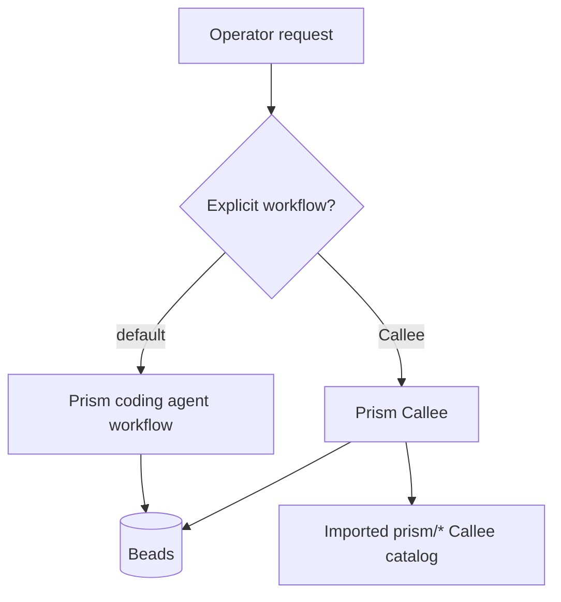
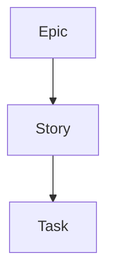
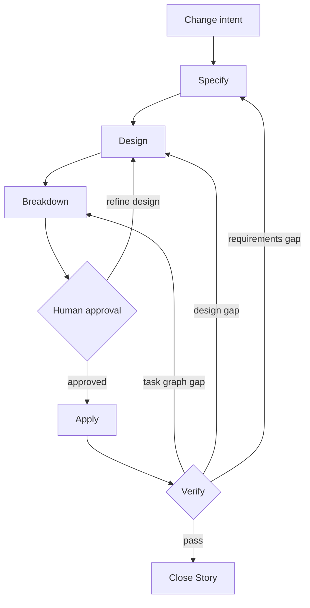
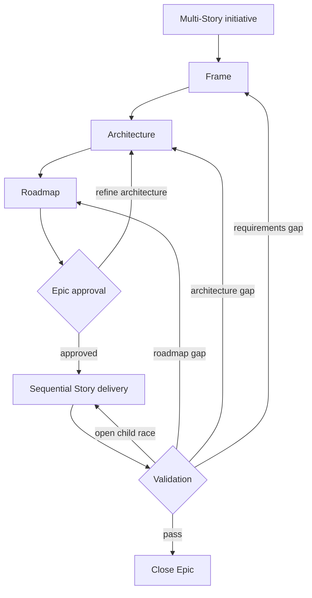
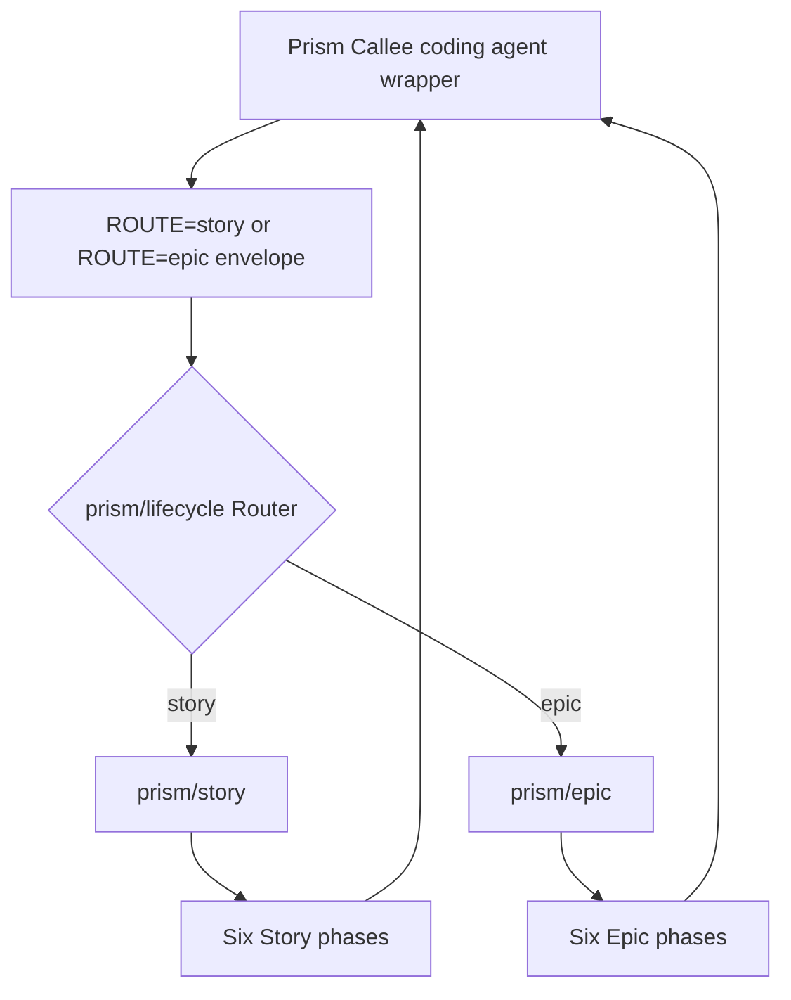

# Prism Architecture

This document describes the current repository architecture. It is an operator
and maintainer map, not a generated audit report.

## Source of truth

When documentation and implementation disagree, use this precedence:

1. plugin manifests and marketplace files define packaging and public names;
2. canonical `plugins/*/skills/` files define coding agent behavior;
3. the external [Prism Callee pack](https://github.com/baldaworks/prism-callee/tree/main/pack/callee/prism) defines direct Callee graphs;
4. `docs/lifecycle-ownership.json` and repository validators define mirrored
   sources and integrity requirements;
5. README and focused architecture documents explain those contracts.

## Plugin boundary

Prism and Prism Callee ship from separate repositories in this priority order:

| Priority | Plugin | Canonical skills | Runtime |
| --- | --- | --- | --- |
| 1 | `prism` | `lifecycle`, `story`, `epic` | Coding agent + Beads |
| 2 | [prism-callee](https://github.com/baldaworks/prism-callee) | `lifecycle` | Coding agent + Beads + imported Callee agents |

Installing one plugin does not install the other. Both use the same Beads
labels, but each owns its own coding agent entrypoints and skill inventory. The primary
router never selects Prism Callee implicitly.



## Durable state

Beads is the only lifecycle state store. An active item has exactly one
supported phase label for its type:

- Story: `phase:story:{specify,design,breakdown,human,apply,verify}`;
- Epic: `phase:epic:{frame,architecture,roadmap,approval,delivery,validation}`.

Unsupported phase-like labels are treated as absent and are never migrated.
Multiple supported phases or a phase from the other item namespace fail
closed. `human:approved` authorizes only the current item and never transfers
between Epics, Stories, or children.

The only supported hierarchy is:



Nested Epics and Tasks directly under an Epic are invalid. Child graphs are
evaluated qualitatively for coverage, cohesion, reviewability, verifiability,
and necessary acyclic dependencies; there is no numeric child-count contract.

## Coding agent routing

`prism:lifecycle` resolves exactly one operation in this order:

1. an explicit all-open-Epic batch;
2. an explicit Story or Epic ID;
3. a Task's parent Story;
4. one unambiguous open Prism item;
5. a new Epic for clear multi-Story initiative intent;
6. a new Story for ordinary change intent.

Batch mode freezes one invocation-start snapshot of open Prism Epics, orders it
by priority, creation time, then ID, and visits every item exactly once. It does
not rescan and approval never moves between snapshot items.

See [Coding agent Lifecycle Router](architecture-host-lifecycle.md).

## Full Story lifecycle



Specify may request clarification before it advances. Apply claims and reviews
one ready Task at a time. Verify performs no repairs: it closes the Story or
returns it to the earliest defective phase.

The full coding agent approval prompt shows Design summary → Task summary → Approval
request. Acceptance is an internal readiness input and appears in coding agent output
only when the operator explicitly requests the current Story criteria.

See [Story Lifecycle](architecture-story-lifecycle.md).

## Epic lifecycle



Epic approval covers only the architecture and Story roadmap. Delivery selects
one ready Story at a time and runs the full Story lifecycle; every Story keeps
its own approval gate. Validation closes or routes the Epic without repairing
implementation.

See [Epic Lifecycle](architecture-epic-lifecycle.md).

## Prism Callee

The coding agent wrapper owns target resolution, Beads reads and writes, approval
authority, batch coordination, and persistence. The imported Callee Router
selects one declared graph from a internal envelope built by the coding agent. The public
plugin entrypoint accepts an ordinary request; operators do not construct the
envelope:



Normal execution resolves `prism/lifecycle`, `prism/story`, and `prism/epic`
from Callee's default imported catalog. `prism/lifecycle` must be a `Router`.
A missing root or an older `Sequential` lifecycle is a stale catalog and must
be repaired by re-importing with `--force`; runtime must not fall back to a
repository checkout. `--agent-root pack/callee` is maintainer-only.

See [Prism Callee Lifecycle](https://github.com/baldaworks/prism-callee/blob/main/docs/architecture-callee-lifecycle.md).

## Mirrors and integrity

Canonical namespaced skills live under `plugins/*/skills/`. Flat-skill coding agents
consume the corresponding `plugins/*/prefixed-skills/` mirrors. Behavioral
drift between those trees fails validation.

Each `plugins/*/` directory is also an Agent Plugins 1.0.0 package root. Its
root `plugin.json` exposes the canonical immediate-child skills under `skills/`;
the portable package does not define installation, invocation syntax, Callee
agents, or a marketplace.

The Callee pack is digest-locked in its own repository. This repository checks
coding agent skill digests, public interfaces, phase sets, approval boundaries, routing
behavior and documentation invariants without a Callee checkout.

## Validation

Run the repository checks from the root:

```sh
./scripts/validate-plugin-packaging.sh
./scripts/validate-lifecycle-ownership.sh
./scripts/validate-documentation.sh
./scripts/test-lifecycle-drift-detection.sh
./scripts/test-documentation-drift-detection.sh
./scripts/test-lifecycle-forward-contracts.sh
```

Provider-backed Human smoke tests are documented separately in
[Prism Callee Human-Step Smoke Tests](https://github.com/baldaworks/prism-callee/blob/main/docs/callee-lifecycle-smoke-test.md).

## Documentation map

| Document | Responsibility |
| --- | --- |
| [README](../README.md) | User-facing selection, installation, update, and quick start |
| [Coding agent router](architecture-host-lifecycle.md) | Target resolution and open-Epic batch semantics |
| [Story](architecture-story-lifecycle.md) | Full coding agent Story lifecycle |
| [Epic](architecture-epic-lifecycle.md) | Full coding agent Epic lifecycle |
| [Callee](https://github.com/baldaworks/prism-callee/blob/main/docs/architecture-callee-lifecycle.md) | Coding agent/Callee ownership and catalog operations |
| [Ownership manifest](lifecycle-ownership.json) | Machine-checked source and digest inventory |
