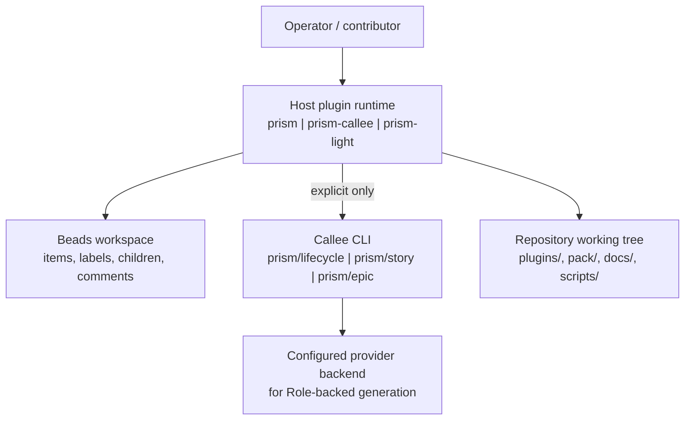
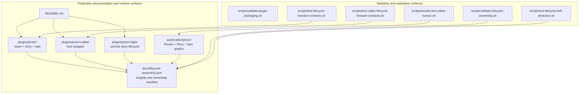

# Prism — Architecture Specification

## 1. Introduction

[KNOWN] Prism is a repository that packages three independent lifecycle plugins over a shared Beads state model: `prism`, `prism-callee`, and `prism-light`, in that priority order. Its purpose is to turn software-change requests into durable Story and Epic workflows with explicit approval boundaries, repository-native execution, and validation surfaces that detect contract drift. Sources: `README.md`, `docs/lifecycle-ownership.json`.

[KNOWN] The primary architecture centers on vertical lifecycle workflows. The host-native `prism` plugin owns the default Story and Epic lifecycles, `prism-callee` owns the host wrapper that delegates one Story or Epic at a time into the canonical `prism/*` Callee pack, and `prism-light` owns a concise host-only Story lifecycle that is always explicit and is never selected by the primary router. Sources: `README.md`, `plugins/prism/skills/lifecycle/SKILL.md`, `plugins/prism-callee/skills/lifecycle/SKILL.md`, `plugins/prism-light/skills/lifecycle/SKILL.md`.

[KNOWN] This specification documents the repository architecture that contributors and operators maintain: plugin boundaries, lifecycle routing, durable state, approval rules, integrity validation, and operational entrypoints. [INFERRED] It is intended to be the umbrella architecture reference above the more focused host, Story, Epic, Callee, and Light documents in `docs/`. Sources: `README.md`, `docs/architecture-host-lifecycle.md`, `docs/architecture-story-lifecycle.md`, `docs/architecture-epic-lifecycle.md`, `docs/architecture-callee-lifecycle.md`, `docs/architecture-light-lifecycle.md`.

## 2. Definitions

| Term | Definition |
| --- | --- |
| Beads | [KNOWN] The durable issue tracker and state store Prism uses for item metadata, labels, children, comments, and approvals. Source: `README.md`, `docs/lifecycle-ownership.json`. |
| Story | [KNOWN] A Beads item type representing one software change lifecycle with phases `phase:story:*`. Source: `docs/lifecycle-ownership.json`, `plugins/prism/skills/story/SKILL.md`. |
| Epic | [KNOWN] A Beads item type representing a multi-Story initiative with phases `phase:epic:*`. Source: `docs/lifecycle-ownership.json`, `plugins/prism/skills/epic/SKILL.md`. |
| Task | [KNOWN] A child work item under a Story. Direct Tasks under an Epic are invalid. Source: `docs/lifecycle-ownership.json`, `plugins/prism/skills/epic/SKILL.md`. |
| Host plugin | [KNOWN] A Prism plugin that runs directly in the host environment instead of invoking Callee for its main lifecycle logic. Source: `README.md`, `plugins/prism/skills/story/SKILL.md`, `plugins/prism-light/skills/lifecycle/SKILL.md`. |
| Prism host | [KNOWN] The `prism` plugin that owns the default router, full Story lifecycle, and Epic lifecycle. Source: `README.md`, `plugins/prism/skills/lifecycle/SKILL.md`. |
| Prism Callee | [KNOWN] The `prism-callee` plugin that wraps the canonical `prism/*` Callee pack while the host remains responsible for Beads resolution and persistence. Source: `README.md`, `plugins/prism-callee/skills/lifecycle/SKILL.md`. |
| Prism Light | [KNOWN] The `prism-light` plugin that provides a concise host-only Story lifecycle and is selected only by explicit invocation. Source: `README.md`, `plugins/prism-light/skills/lifecycle/SKILL.md`. |
| Callee pack | [KNOWN] The checked-in `pack/callee/prism/` Router, Story graph, Epic graph, and related phase/role agents. Source: `README.md`, `docs/architecture-callee-lifecycle.md`. |
| Router | [KNOWN] The component that selects exactly one lifecycle path for a request: the host router in `prism`, or the direct Story/Epic Router in the Callee pack. Source: `plugins/prism/skills/lifecycle/SKILL.md`, `plugins/prism-callee/skills/lifecycle/SKILL.md`, `pack/callee/prism/lifecycle.md`. |
| Namespaced skill | [KNOWN] A host skill invoked with the plugin namespace, such as `$prism:lifecycle`. Source: `README.md`, `docs/lifecycle-ownership.json`. |
| Flat surface | [KNOWN] A mirror skill tree used by flat-skill hosts, such as `/prism-lifecycle` or `/prism-light`. Source: `README.md`, `docs/lifecycle-ownership.json`. |
| `human:approved` | [KNOWN] The Beads label that authorizes only the current item’s Apply or Approval transition. Source: `docs/lifecycle-ownership.json`, `plugins/prism/skills/story/SKILL.md`, `plugins/prism-callee/skills/lifecycle/SKILL.md`. |
| Vertical lifecycle workflow | [KNOWN] The repository convention that lifecycle diagrams and workflow descriptions are expressed top-to-bottom, and that lifecycle documentation preserves the priority order Prism host → Prism Callee → Prism Light. Sources: `README.md`, `plugins/prism-light/skills/lifecycle/SKILL.md`, `docs/architecture-host-lifecycle.md`, `docs/architecture-callee-lifecycle.md`, `docs/architecture-light-lifecycle.md`. |

## 3. Architectural Scope

[KNOWN] This architecture covers the Prism repository’s three-plugin lifecycle system, the shared Beads durable state model, the direct Callee pack, the plugin-facing invocation surfaces for supported hosts, and the repository validation scripts that enforce packaging and lifecycle ownership contracts. Sources: `README.md`, `docs/lifecycle-ownership.json`, `scripts/validate-plugin-packaging.sh`, `scripts/validate-lifecycle-ownership.sh`.

[KNOWN] Supported execution modes within scope are:

- host-native Story and Epic execution through `prism`;
- host-managed Story and Epic execution through `prism-callee` plus the imported `prism/*` Callee resources;
- concise host-native Story execution through `prism-light`;
- direct maintainer validation of the checked-in Callee pack and lifecycle integrity scripts.

Sources: `README.md`, `plugins/prism/skills/lifecycle/SKILL.md`, `plugins/prism-callee/skills/lifecycle/SKILL.md`, `plugins/prism-light/skills/lifecycle/SKILL.md`, `docs/callee-lifecycle-smoke-test.md`.

[KNOWN] Out of scope are the internal implementations of Beads, Callee, host marketplaces, and provider backends; this document describes how Prism depends on them, not their internal architecture. [KNOWN] Also out of scope are application-specific feature implementations that Prism workflows may modify in downstream repositories. Sources: `README.md`, `plugins/prism/skills/lifecycle/SKILL.md`, `plugins/prism-callee/skills/lifecycle/SKILL.md`, `plugins/prism-light/skills/lifecycle/SKILL.md`.

## 4. Assumptions and Limitations

- [KNOWN][Permanent] Prism documentation and packaging preserve the plugin priority order `prism`, `prism-callee`, `prism-light`. This ordering is part of the product boundary, not a presentation choice. Sources: `README.md`, `docs/lifecycle-ownership.json`.

- [KNOWN][Permanent] Prism Light is explicit-only. The primary router must not select it implicitly. Sources: `plugins/prism/skills/lifecycle/SKILL.md`, `docs/architecture-light-lifecycle.md`.

- [KNOWN][Permanent] Direct Callee execution requires a host-compatible route envelope beginning with exactly `ROUTE=story` or `ROUTE=epic`; a raw free-form request is not a valid `prism/lifecycle` input. Sources: `plugins/prism-callee/skills/lifecycle/SKILL.md`, `docs/architecture-callee-lifecycle.md`.

- [KNOWN][Permanent] Unsupported phase-like labels are treated as absent and are never migrated; multiple supported phases or a phase from the wrong namespace fail closed. Sources: `docs/lifecycle-ownership.json`, `plugins/prism/skills/story/SKILL.md`, `plugins/prism/skills/epic/SKILL.md`, `plugins/prism-callee/skills/lifecycle/SKILL.md`.

- [KNOWN][Permanent] The only supported work-item hierarchy is Epic → Story → Task. Nested Epics and direct Epic Tasks are invalid. Sources: `docs/lifecycle-ownership.json`, `plugins/prism/skills/epic/SKILL.md`, `plugins/prism-callee/skills/lifecycle/SKILL.md`.

- [KNOWN][Temporary] Repository-local Callee validation may require an ordinary unsandboxed shell because provider-backed local runs can need writable host state outside the repository. This is a maintainer limitation, not a lifecycle contract change. Source: `docs/callee-lifecycle-smoke-test.md`.

- [KNOWN][Temporary] The repository does not identify named architecture, development, test, or program-management contacts in checked-in documentation. Section 7 therefore records `[UNKNOWN]` values. Source: repository-wide documentation scan under `README.md`, `docs/`, `plugins/`, `pack/`.

- [KNOWN] Examined: `README.md`, all `docs/*.md` lifecycle documents, `docs/lifecycle-ownership.json`, host skill contracts under `plugins/**/skills/**`, the Callee pack under `pack/callee/prism/`, and lifecycle/package validation scripts under `scripts/`. Method: repository-local file inspection with `rg` and direct file reads, followed by validator execution. Excluded: external Beads source, external Callee source, host marketplace services, and live provider backends because they are not part of this repository. Limitations: no live end-to-end host workflow was executed in this documentation task. Sources: `README.md`, `docs/lifecycle-ownership.json`, `scripts/validate-plugin-packaging.sh`, `scripts/validate-lifecycle-ownership.sh`.

## 5. Architecture Description

### 5.1 Protocol / System Description

#### 5.1.1 Three-plugin system boundary

[KNOWN] Prism exposes three independent plugins over a shared durable Beads model:

| Priority | Plugin | Canonical skills | Runtime boundary |
| --- | --- | --- | --- |
| 1 | `prism` | `lifecycle`, `story`, `epic` | Host + Beads |
| 2 | `prism-callee` | `lifecycle` | Host + Beads + Callee |
| 3 | `prism-light` | `lifecycle` | Host + Beads |

Sources: `README.md`, `docs/lifecycle-ownership.json`.

[KNOWN] Each plugin has separate manifests, skill inventories, and marketplace surfaces; installing one does not implicitly install the others. Sources: `README.md`, `scripts/validate-plugin-packaging.sh`.

#### 5.1.2 Host router behavior

[KNOWN] The primary router in `prism` resolves one operation in deterministic priority order: explicit all-open-Epic batch, explicit Story/Epic ID, Task-parent Story dispatch, unambiguous single-item resume, clear multi-Story initiative intent, then ordinary Story intent. Sources: `plugins/prism/skills/lifecycle/SKILL.md`, `docs/lifecycle-ownership.json`.

[KNOWN] Explicit “process all open Prism epics” mode takes one invocation-start snapshot of open Prism Epics labeled `prism`, sorts them by priority, creation time, and ID, visits each exactly once and sequentially, continues after item-local stops, and never rescans. Sources: `plugins/prism/skills/lifecycle/SKILL.md`, `docs/architecture-host-lifecycle.md`, `docs/lifecycle-ownership.json`.

#### 5.1.3 Full host Story and Epic lifecycles

[KNOWN] The full host Story lifecycle uses six supported durable phases: Specify, Design, Breakdown, Human, Apply, and Verify, encoded only by exactly one `phase:story:*` label. Story assignees do not encode lifecycle phase state. Sources: `plugins/prism/skills/story/SKILL.md`, `docs/lifecycle-ownership.json`.

[KNOWN] The full host Epic lifecycle uses six supported durable phases: Frame, Architecture, Roadmap, Approval, Delivery, and Validation, encoded only by exactly one `phase:epic:*` label. Epic Delivery advances eligible Stories sequentially through the Story lifecycle; Epic approval never approves child Story implementation. Sources: `plugins/prism/skills/epic/SKILL.md`, `docs/lifecycle-ownership.json`.

[KNOWN] Both host lifecycles evaluate child graphs qualitatively by coverage, cohesion, reviewability, verifiability, and necessary acyclic dependencies. There is no fixed child-count minimum or maximum. Sources: `docs/lifecycle-ownership.json`, `docs/architecture-story-lifecycle.md`, `docs/architecture-epic-lifecycle.md`.

#### 5.1.4 Prism Callee workflow

[KNOWN] `prism-callee` is the only Prism host surface allowed to execute `callee agent run prism/...`. The host resolves Beads state, approval authority, batching, and persistence; the Callee Router selects exactly one direct Story or Epic graph. Sources: `plugins/prism-callee/skills/lifecycle/SKILL.md`, `docs/architecture-callee-lifecycle.md`.

[KNOWN] Normal installed execution resolves `prism/lifecycle`, `prism/story`, and `prism/epic` from Callee’s default imported catalog. [KNOWN] `--agent-root pack/callee` is reserved for repository maintenance and validation of the checked-in pack. Sources: `plugins/prism-callee/skills/lifecycle/SKILL.md`, `docs/architecture-callee-lifecycle.md`.

#### 5.1.5 Prism Light workflow

[KNOWN] Prism Light reuses the durable Story phase model but runs a shorter host-native contract that is explicit-only and never selected by the primary router. [KNOWN] It keeps the concise approval presentation `Acceptance criteria → Design summary → Task summary → Approval request`. Sources: `plugins/prism-light/skills/lifecycle/SKILL.md`, `docs/architecture-light-lifecycle.md`.

#### 5.1.6 Approval and output contracts

[KNOWN] Only explicit human intent authorizes Apply or Approval. `human:approved` is item-scoped and does not transfer across Stories, Epics, or children. Sources: `README.md`, `docs/lifecycle-ownership.json`, `plugins/prism/skills/story/SKILL.md`, `plugins/prism-callee/skills/lifecycle/SKILL.md`.

[KNOWN] The full host Story and Epic lifecycles suppress a standalone user-facing `### Acceptance criteria` section unless the operator explicitly requests the current item’s criteria. [KNOWN] Prism Callee suppresses unsolicited acceptance in normal output but requires the complete current-item acceptance section in the informed Story Human or Epic Approval request. Sources: `docs/lifecycle-ownership.json`, `plugins/prism/skills/story/SKILL.md`, `plugins/prism/skills/epic/SKILL.md`, `plugins/prism-callee/skills/lifecycle/SKILL.md`.

### 5.2 Network Architecture

[INFERRED] Prism is primarily a local host-and-CLI architecture, but execution can cross network boundaries when a host or Callee role uses a configured provider backend, and when operators install plugins or Callee resources from a marketplace or remote source. This inference is grounded by the Callee requirement for provider authentication and the maintainer note that automated Role generation is codex-backed. Sources: `plugins/prism-callee/skills/lifecycle/SKILL.md`, `docs/callee-lifecycle-smoke-test.md`, `README.md`.

[KNOWN] Infrastructure dependencies inside scope are the local repository checkout, a Beads workspace, and for `prism-callee` a discoverable imported Prism Callee catalog. [INFERRED] External dependencies may include DNS, outbound HTTPS, and provider authentication for installed hosts or Callee role execution, but those mechanisms are owned by the external host and provider systems rather than by Prism. Sources: `README.md`, `plugins/prism-callee/skills/lifecycle/SKILL.md`, `docs/callee-lifecycle-smoke-test.md`.

### 5.3 Software Architecture

[KNOWN] The repository is organized into production lifecycle surfaces and validation surfaces:

#### 5.3.1 Plugin components

[KNOWN] `plugins/prism/skills/lifecycle/` owns target resolution and open-Epic batch coordination, `plugins/prism/skills/story/` owns the full host Story contract, and `plugins/prism/skills/epic/` owns the host Epic contract. Sources: `docs/lifecycle-ownership.json`, `plugins/prism/skills/lifecycle/SKILL.md`, `plugins/prism/skills/story/SKILL.md`, `plugins/prism/skills/epic/SKILL.md`.

[KNOWN] `plugins/prism-callee/skills/lifecycle/` owns host-to-Callee mapping, route envelope construction, approval boundaries, and persistence rules for Callee-backed runs. `plugins/prism-light/skills/lifecycle/` owns the concise host Story contract. Sources: `docs/lifecycle-ownership.json`, `plugins/prism-callee/skills/lifecycle/SKILL.md`, `plugins/prism-light/skills/lifecycle/SKILL.md`.

#### 5.3.2 Mirror surfaces and integrity control

[KNOWN] Every namespaced host skill tree has a flat mirror tree for compatible hosts. The ownership validator requires the canonical and flat Markdown inventories to match and normalizes expected naming differences, such as `prism-light` versus `lifecycle` directory names. Sources: `docs/lifecycle-ownership.json`, `scripts/validate-lifecycle-ownership.sh`.

[KNOWN] The ownership manifest records per-file and aggregate SHA-256 digests for all managed host sources and the Callee pack. Unsynchronized drift fails validation. Sources: `docs/lifecycle-ownership.json`, `scripts/validate-lifecycle-ownership.sh`, `scripts/test-lifecycle-drift-detection.sh`.

#### 5.3.3 Callee pack boundary

[KNOWN] `pack/callee/prism/` is the checked-in behavioral source for the public Callee Router, direct Story graph, and direct Epic graph. [KNOWN] Marketplace runtime must resolve imported resources from Callee’s default catalog and must not depend on a Prism repository checkout. Sources: `plugins/prism-callee/skills/lifecycle/SKILL.md`, `docs/architecture-callee-lifecycle.md`.

### 5.4 Programming Interfaces

| Interface | Shape | Audience | Exposure | Permissions / authority | Extensibility |
| --- | --- | --- | --- | --- | --- |
| `prism` host plugin | [KNOWN] Host skill invocations such as `$prism:lifecycle`, `$prism:story`, `/prism-lifecycle` | Repository users and operators | Public | [KNOWN] Requires host access to the repository and Beads workspace; Apply still requires explicit human approval | [KNOWN] Separate router, Story, and Epic skills allow host-specific packaging while preserving shared contracts |
| `prism-callee` host plugin | [KNOWN] Host skill invocation such as `$prism-callee:lifecycle` | Operators who want specialized Callee execution | Public | [KNOWN] Requires host access, Beads workspace, imported Callee resources, and explicit approval gates | [KNOWN] Extends the host surface by delegating to the direct Callee pack without changing Beads ownership |
| `prism-light` host plugin | [KNOWN] Host skill invocation such as `$prism-light:lifecycle` or `/prism-light` | Users who want the concise host Story lifecycle | Public | [KNOWN] Requires host access and Beads workspace; Apply still requires explicit approval | [KNOWN] Minimal single-skill surface; explicit-only by design |
| Direct Callee Router | [KNOWN] CLI invocation `callee agent run prism/lifecycle --message "$envelope"` | Maintainers and advanced operators | Public binary surface, but not the default host UX | [KNOWN] Requires a correctly formed route envelope and imported Prism resources; host remains authoritative for lifecycle persistence | [KNOWN] Router can select Story or Epic graphs only; no undeclared default route |
| Beads CLI interactions | [KNOWN] CLI reads and writes such as `bd where`, `bd list`, `bd show`, `bd create` | Host and maintainer workflows | External dependency | [KNOWN] Requires repository/project Beads workspace access | [KNOWN] Prism contracts depend on item types, labels, parentage, and children rather than host-specific storage formats |
| Validation scripts | [KNOWN] Local shell entrypoints under `scripts/` | Contributors and operators | Public maintainer surface | [KNOWN] Requires repository checkout and the relevant CLI prerequisites | [KNOWN] Additional checks can be added by extending scripts and updating ownership metadata |

Sources: `README.md`, `docs/lifecycle-ownership.json`, `plugins/prism/skills/lifecycle/SKILL.md`, `plugins/prism-callee/skills/lifecycle/SKILL.md`, `plugins/prism-light/skills/lifecycle/SKILL.md`, `docs/callee-lifecycle-smoke-test.md`, `scripts/validate-plugin-packaging.sh`, `scripts/validate-lifecycle-ownership.sh`.

### 5.5 Persisted State

| Store | What is stored | Where it is stored | Scope | Permissions to read / modify | Format | Upgrade / portability considerations |
| --- | --- | --- | --- | --- | --- | --- |
| Beads workspace | [KNOWN] Item descriptions, acceptance, design, labels, children, comments, assignees, status, and approval labels used by Prism lifecycles | External Beads project workspace | Project-wide durable runtime state | [KNOWN] Read/write access through `bd` commands in the current workspace | [KNOWN] Beads-managed issue data | [KNOWN] Missing supported phases are reinitialized by item type; unsupported labels are treated as absent and never migrated |
| Lifecycle ownership manifest | [KNOWN] Public interfaces, phase namespaces, routing policy, ownership mapping, and SHA-256 digests for managed sources | `docs/lifecycle-ownership.json` | Repository-wide | Read/write in the repository | JSON | [KNOWN] Source changes that affect managed lifecycle surfaces require digest updates or validation fails |
| Plugin packaging metadata | [KNOWN] Plugin names, descriptions, skills directories, and host-facing metadata | Plugin manifests under `plugins/**/.plugin*` and agent metadata under `plugins/**/agents/openai.yaml` | Repository-wide | Read/write in the repository | JSON and YAML | [KNOWN] Packaging validation enforces expected inventories, names, and default prompts |
| Checked-in lifecycle contracts | [KNOWN] Host skill Markdown, Light references, Callee wrapper references, and Callee pack Markdown | `plugins/**/SKILL.md`, `plugins/**/references/*.md`, `pack/callee/prism/**/*.md` | Repository-wide source of truth | Read/write in the repository | Markdown | [KNOWN] Host source and Callee pack mutations are digest-locked by the ownership manifest and validator |

Sources: `docs/lifecycle-ownership.json`, `plugins/prism/skills/lifecycle/SKILL.md`, `plugins/prism-callee/skills/lifecycle/SKILL.md`, `plugins/prism-light/skills/lifecycle/SKILL.md`, `scripts/validate-plugin-packaging.sh`, `scripts/validate-lifecycle-ownership.sh`.

## 6. Architectural Implications

### 6.1 Security

[KNOWN] The central trust boundary is human approval. The architecture forbids implicit approval, approval transfer between items, and implementation without persisted `human:approved` on the current item. Sources: `README.md`, `docs/lifecycle-ownership.json`, `plugins/prism/skills/story/SKILL.md`, `plugins/prism-callee/skills/lifecycle/SKILL.md`.

[KNOWN] Routing and phase validation fail closed on malformed route envelopes, ambiguous or missing targets, invalid hierarchy, multiple supported phases, and cross-namespace phase misuse. This reduces the attack surface from malformed input or stale state. Sources: `plugins/prism/skills/lifecycle/SKILL.md`, `plugins/prism-callee/skills/lifecycle/SKILL.md`, `plugins/prism/skills/story/SKILL.md`, `plugins/prism/skills/epic/SKILL.md`.

[KNOWN] Prism deliberately restricts provider authority: provider output must not select routes, invent approval, or own persistence. [INFERRED] This architecture treats hosts, Callee, and provider backends as partially trusted execution layers around a host-owned control plane. Sources: `plugins/prism-callee/skills/lifecycle/SKILL.md`, `docs/callee-lifecycle-smoke-test.md`.

### 6.2 Performance

#### 6.2.1 Scale Up

[KNOWN] No benchmarked CPU, memory, latency, or throughput targets are documented in the repository. [UNKNOWN] Quantitative runtime SLOs therefore cannot be stated from repository evidence alone.

[KNOWN] The architecture intentionally scales by sequencing rather than concurrency for workflow correctness:

- open-Epic batch mode processes one frozen snapshot at a time and advances items sequentially;
- Epic Delivery advances one eligible Story at a time;
- Story Apply claims one ready child Task at a time.

Sources: `plugins/prism/skills/lifecycle/SKILL.md`, `plugins/prism/skills/epic/SKILL.md`, `plugins/prism-callee/skills/lifecycle/SKILL.md`.

#### 6.2.2 Scale Down

[KNOWN] Prism Light is the scale-down path inside the repository architecture because it removes Callee from the execution path while preserving the same durable Story phase model. Sources: `README.md`, `plugins/prism-light/skills/lifecycle/SKILL.md`.

[INFERRED] Host-native execution also reduces process fan-out compared with `prism-callee`, which must coordinate host logic plus Callee graph execution. Sources: `plugins/prism-callee/skills/lifecycle/SKILL.md`, `plugins/prism-light/skills/lifecycle/SKILL.md`.

#### 6.2.3 Offloads

[KNOWN] Route selection, Beads reads/writes, approval persistence, and lifecycle validation remain local to the host and repository tooling. Sources: `plugins/prism/skills/lifecycle/SKILL.md`, `plugins/prism-callee/skills/lifecycle/SKILL.md`, `scripts/validate-lifecycle-ownership.sh`.

[INFERRED] Provider-backed content generation is the primary compute offload path, reached either through host-native model execution or Callee Role-backed execution, while Prism retains local control over state transitions and approvals. Sources: `plugins/prism-callee/skills/lifecycle/SKILL.md`, `docs/callee-lifecycle-smoke-test.md`.

### 6.3 Management

[KNOWN] Operators manage Prism through plugin installation, Beads workspace initialization, Callee resource import, and repository-local validation commands. Sources: `README.md`, `docs/callee-lifecycle-smoke-test.md`.

[KNOWN] Administrative interfaces are command-oriented:

- host plugin installation commands for Codex, Claude Code, Grok, Copilot CLI, Cursor, and flat-skill hosts;
- `bd where`, `bd prime`, `bd list`, `bd show`, `bd create`, and related Beads commands;
- `callee agent import`, `callee agent list`, `callee agent view`, and `callee agent run`;
- validation scripts under `scripts/`.

Sources: `README.md`, `plugins/prism-callee/skills/lifecycle/SKILL.md`, `docs/callee-lifecycle-smoke-test.md`.

[KNOWN] Centralized management beyond the checked-in manifests and validation scripts is not documented in the repository. [UNKNOWN] No policy engine, remote admin API, or centralized fleet control plane is described here.

### 6.4 Observability

[KNOWN] Prism exposes observability primarily through CLI output, JSON-capable inspection commands, validation scripts, and smoke-test diagnostics rather than through a dedicated metrics or telemetry subsystem. Sources: `README.md`, `docs/callee-lifecycle-smoke-test.md`, `scripts/validate-lifecycle-ownership.sh`, `scripts/test-lifecycle-drift-detection.sh`.

[KNOWN] Key diagnostic surfaces include:

- `bd show ... --json` and `bd list ... --json` for durable state inspection;
- `callee agent view prism/... --json` for imported resource inspection;
- SHA-256 inventory checks in `docs/lifecycle-ownership.json`;
- PTY-backed smoke-test diagnostics retained under `/tmp` when requested.

Sources: `plugins/prism/skills/lifecycle/SKILL.md`, `plugins/prism-callee/skills/lifecycle/SKILL.md`, `docs/callee-lifecycle-smoke-test.md`, `scripts/validate-lifecycle-ownership.sh`.

[KNOWN] No repository-local evidence describes a dedicated telemetry collector, privacy pipeline, or exported metrics schema. [UNKNOWN] Any host-level telemetry is outside the repository boundary documented here.

### 6.5 Testing

[KNOWN] Prism uses layered repository-local testing:

- packaging validation in `scripts/validate-plugin-packaging.sh`;
- lifecycle ownership and mirror validation in `scripts/validate-lifecycle-ownership.sh`;
- digest-drift detection in `scripts/test-lifecycle-drift-detection.sh`;
- forward-contract regression checks for host and Callee lifecycle surfaces;
- PTY-backed Callee Human smoke tests in `scripts/smoke-test-callee-human.sh`.

Sources: `README.md`, `docs/callee-lifecycle-smoke-test.md`, `scripts/validate-plugin-packaging.sh`, `scripts/validate-lifecycle-ownership.sh`, `scripts/test-lifecycle-drift-detection.sh`, `scripts/test-lifecycle-forward-contracts.sh`, `scripts/test-callee-lifecycle-forward-contracts.sh`.

[KNOWN] Test isolation relies on repository-local digests, mirror comparison, and temporary directories for drift checks and smoke-test artifacts. [KNOWN] Reproducibility challenges are concentrated in provider-backed PTY flows, which is why the smoke-test document calls out prerequisites such as `script(1)`, `mkfifo`, `rg`, and, for some local runs, an unsandboxed writable host environment. Sources: `docs/callee-lifecycle-smoke-test.md`, `scripts/test-lifecycle-drift-detection.sh`.

## 7. Contacts

| Role | Name | Alias/Handle |
| --- | --- | --- |
| Architect | [UNKNOWN] | [UNKNOWN] |
| Developers | [UNKNOWN] | [UNKNOWN] |
| Testers | [UNKNOWN] | [UNKNOWN] |
| Program managers | [UNKNOWN] | [UNKNOWN] |
| Domain experts | [UNKNOWN] | [UNKNOWN] |

## 8. References

| Short Name | Description | Location |
| --- | --- | --- |
| README | Top-level project overview, installation, validation, and maintainer links | `README.md` |
| Ownership Manifest | Machine-checked public interface, phase, routing, and digest baseline | `docs/lifecycle-ownership.json` |
| Host Router Doc | Summary of the primary host lifecycle router | `docs/architecture-host-lifecycle.md` |
| Story Doc | Summary of the full host Story lifecycle | `docs/architecture-story-lifecycle.md` |
| Epic Doc | Summary of the host Epic lifecycle | `docs/architecture-epic-lifecycle.md` |
| Callee Doc | Summary of the Prism Callee wrapper and direct Callee boundary | `docs/architecture-callee-lifecycle.md` |
| Light Doc | Summary of the concise Prism Light lifecycle | `docs/architecture-light-lifecycle.md` |
| Host Router Skill | Canonical host router contract | `plugins/prism/skills/lifecycle/SKILL.md` |
| Story Skill | Canonical full host Story contract | `plugins/prism/skills/story/SKILL.md` |
| Epic Skill | Canonical host Epic contract | `plugins/prism/skills/epic/SKILL.md` |
| Callee Skill | Canonical Prism Callee host wrapper contract | `plugins/prism-callee/skills/lifecycle/SKILL.md` |
| Light Skill | Canonical Prism Light contract | `plugins/prism-light/skills/lifecycle/SKILL.md` |
| Callee Pack | Checked-in direct Callee Router, Story, and Epic graphs | `pack/callee/prism/` |
| Packaging Validator | Plugin packaging and manifest validation | `scripts/validate-plugin-packaging.sh` |
| Ownership Validator | Lifecycle ownership, mirror, and digest validation | `scripts/validate-lifecycle-ownership.sh` |
| Drift Detection | Negative tests for digest-locked lifecycle drift | `scripts/test-lifecycle-drift-detection.sh` |
| Host Forward Contracts | Host lifecycle forward-contract regression checks | `scripts/test-lifecycle-forward-contracts.sh` |
| Callee Forward Contracts | Prism Callee forward-contract regression checks | `scripts/test-callee-lifecycle-forward-contracts.sh` |
| Human Smoke Tests | PTY-backed local Callee Human-step smoke-test guidance | `docs/callee-lifecycle-smoke-test.md` |

## 9. Change History

| Date | Author | Description of Changes |
| --- | --- | --- |
| 2026-08-04 | Codex | Replaced the summary page with a full architecture specification grounded in the checked-in lifecycle contracts, validators, and maintainer documentation; preserved the vertical lifecycle workflow priority order Prism host → Prism Callee → Prism Light. |
