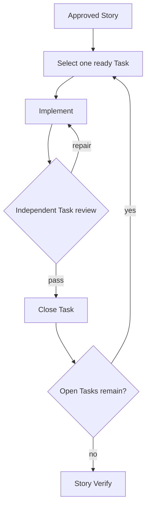

# Story Lifecycle

`prism:story` runs the full host-native lifecycle for one Beads Story. It keeps
durable state in Beads, preserves role-aligned phase contracts, and never
invokes Callee.

## State machine

```mermaid
flowchart TB
    I["Change intent"] --> S["Specify"]
    S --> G{"Design-ready?"}
    G -->|clarify| Q["Human clarification"]
    Q --> S
    G -->|ready| D["Design"]
    D --> B["Breakdown"]
    B --> H{"Human approval"}
    H -->|approved| A["Apply"]
    H -->|refine design| D
    A --> V{"Verify"]
    V -->|pass| C["Close Story"]
    V -->|task graph gap| B
    V -->|design gap| D
    V -->|requirements gap| S
```

An active Story has exactly one supported phase label:

1. `phase:story:specify`
2. `phase:story:design`
3. `phase:story:breakdown`
4. `phase:story:human`
5. `phase:story:apply`
6. `phase:story:verify`

A Story with no supported Story phase starts at Specify and clears stale
approval. Unsupported phase-like labels are absent and never migrated. An Epic
phase or multiple Story phases fail closed.

## Gates and Task delivery

Specify produces design-ready requirements and complete acceptance. Breakdown
creates or reconciles direct Task children using qualitative coverage,
cohesion, reviewability, verifiability, and necessary acyclic dependencies.
There is no numeric Task-count contract.

The host approval prompt shows exactly:

1. Design summary;
2. Task summary;
3. Approval request.

Acceptance remains an internal readiness input and appears only when the
operator explicitly requests the current Story criteria. Only unambiguous
approval writes `human:approved`; questions, conditions, denial, and ambiguity
keep the gate closed.



Verify performs no repairs. It closes the Story only when acceptance and
required checks pass, otherwise it returns the Story to the earliest defective
phase.

## Sources

| Surface | Source |
| --- | --- |
| Namespaced | `plugins/prism/skills/story/` |
| Flat | `plugins/prism/prefixed-skills/prism-story/` |

These trees are behavioral mirrors covered by the ownership validator.
