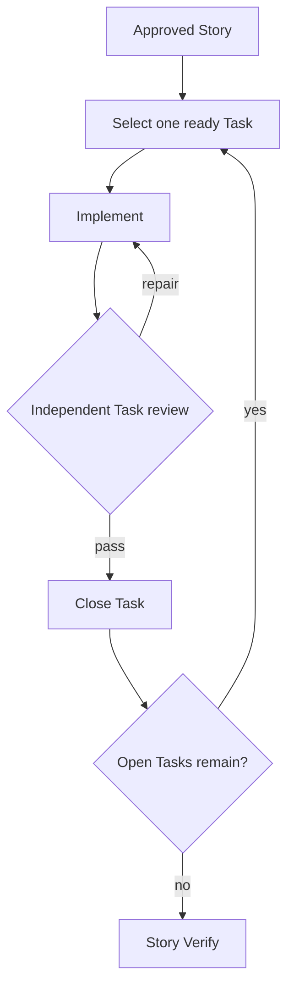

# Story Lifecycle

`prism:story` runs the full coding agent lifecycle for one Beads Story. It keeps
durable state in Beads, preserves role-aligned phase contracts, and never
invokes Callee.

## State machine

```mermaid
flowchart TB
    I["Change intent"] --> S["Specify"]
    S --> G{"Design-ready?"}
    G -->|clarify| Q["Human clarification"]
    Q --> S
    G -->|ready| D["Design"]
    D --> B["Breakdown"]
    B --> H{"Human approval"}
    H -->|approved| A["Apply"]
    H -->|refine design| D
    A --> V{"Verify"]
    V -->|pass| C["Close Story"]
    V -->|task graph gap| B
    V -->|design gap| D
    V -->|requirements gap| S
```

An active Story has exactly one supported phase label:

1. `phase:story:specify`
2. `phase:story:design`
3. `phase:story:breakdown`
4. `phase:story:human`
5. `phase:story:apply`
6. `phase:story:verify`

A Story with no supported Story phase starts at Specify and clears stale
approval. Unsupported phase-like labels are absent and never migrated. An Epic
phase or multiple Story phases fail closed.

## Gates and Task delivery

Specify produces design-ready requirements and complete acceptance. Breakdown
creates or reconciles direct Task children using qualitative coverage,
cohesion, reviewability, verifiability, and necessary acyclic dependencies.
There is no numeric Task-count contract.

## Example: acceptance saved in Beads

Specify saves a Story's acceptance criteria in Beads alongside its requirements.
There is no separate acceptance-criteria phase. This historical snapshot comes
from closed Story `prism-8xz`:

**Show Story and Epic acceptance only on explicit request**

Its complete `acceptance_criteria` field is shown as Markdown source:

```markdown
REQ-OUTPUT-001
- Given normal full Story or Epic output and no explicit criteria request, when output is rendered, then it contains neither a standalone acceptance criteria heading nor an approval-format acceptance block.

REQ-OUTPUT-002
- Given a ready Story Human gate or Epic Approval gate and no explicit criteria request, when its pre-approve prompt is rendered, then acceptance criteria are omitted.

REQ-STORY-001
- Given a ready Story at Human, when pre-approve is rendered, then it contains Design summary, Task summary, and Approval request in that order.

REQ-EPIC-001
- Given a ready Epic at Approval, when pre-approve is rendered, then it contains Architecture summary, Story roadmap, and Approval request in that order.

REQ-READY-001
- Given missing or unusable current-item acceptance, when the gate runs, then Story returns to phase:story:specify or Epic returns to phase:epic:frame, approval is cleared, and no approval request is presented.

REQ-REQUEST-001
- Given an explicit operator request for acceptance criteria, when the lifecycle responds, then it may show complete untruncated acceptance for the current item only.

REQ-TEST-001
- Contract validation fails if either full host Story Human or Epic Approval reference declares acceptance as an unsolicited prompt section or either main skill declares a pre-approve exception.

REQ-COMPAT-001
- Requirements documents, Beads acceptance fields, and machine-readable acceptance sections remain permitted.
```

The coding agent approval prompt shows exactly:

1. Design summary;
2. Task summary;
3. Approval request.

Acceptance remains an internal readiness input and appears only when the
operator explicitly requests the current Story criteria. Only unambiguous
approval writes `human:approved`; questions, conditions, denial, and ambiguity
keep the gate closed.


```mermaid
flowchart TB
    A["Approved Story"] --> R["Select one ready Task"]
    R --> I["Implement"]
    I --> V{"Independent Task review"}
    V -->|repair| I
    V -->|pass| C["Close Task"]
    C --> M{"Open Tasks remain?"}
    M -->|yes| R
    M -->|no| SV["Story Verify"]
```

Verify performs no repairs. It closes the Story only when acceptance and
required checks pass, otherwise it returns the Story to the earliest defective
phase.

## Sources

| Surface | Source |
| --- | --- |
| Namespaced | `plugins/prism/skills/story/` |
| Flat | `plugins/prism/prefixed-skills/prism-story/` |

These trees are behavioral mirrors covered by the ownership validator.
