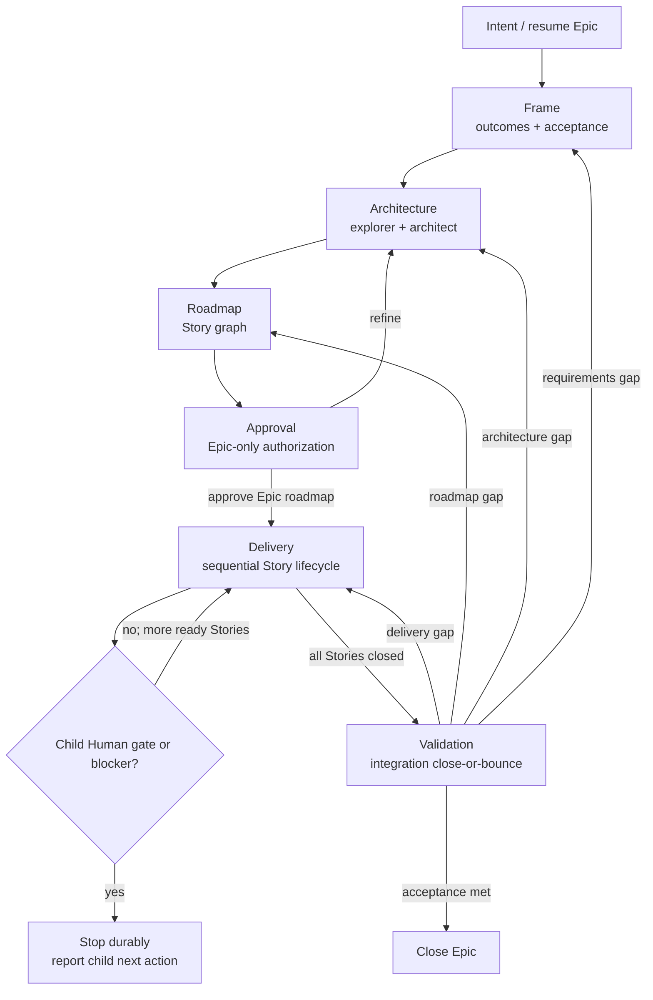

# Prism Epic lifecycle graph

## Invariants

- Exactly one supported `phase:epic:*` label represents active Epic state.
- Unsupported phase labels are absent and never migrated.
- Direct children are Stories; Story children own implementation Tasks.
- Epic approval covers architecture and roadmap only and never cascades.
- Delivery advances one ready Story at a time and stops at child Human input or
  blocking state.
- Validation closes or bounces and performs no repairs.
