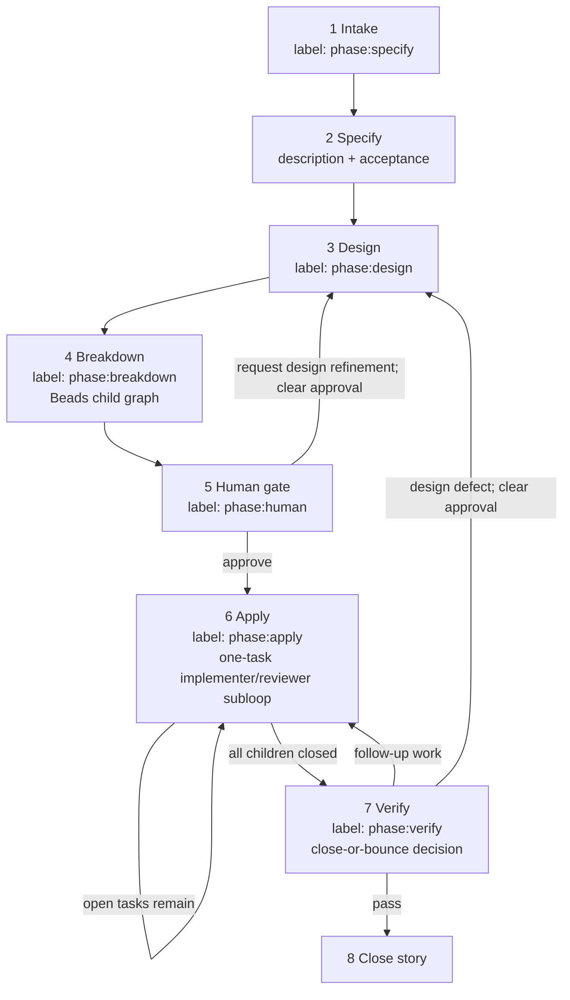

# Prism lifecycle graph

Lifecycle starts from user intent. It uses an explicitly named story ID when
present, otherwise resumes exactly one open Prism story; if neither applies, it
creates a new story labeled `phase:specify`. Exactly one supported `phase:*`
label is the durable lifecycle state. `prism` marks lifecycle membership and,
after approval, `human:approved` authorizes apply. The host-native Prism skill
continues through successful pre-approval phases in one invocation; the Prism
Callee workflow runs the same advance-until-gate contract through specialized
`prism/*` subagents.

## Graph

Keep workflow diagrams vertical and top-to-bottom.



## Story state

| Step | Story phase label | Other labels |
| --- | --- | --- |
| Intake / specify | `phase:specify` | `prism` |
| Design | `phase:design` | `prism` |
| Breakdown | `phase:breakdown` | `prism` |
| Human gate | `phase:human` | `prism` |
| Apply | `phase:apply` | `prism`, `human:approved` |
| Verify | `phase:verify` | `prism`, `human:approved` |
| Done | closed | unchanged |

Derive phase from exactly one supported story `phase:*` label. Reconcile it
with requirements, design, children, and approval. Do not fall back to story
assignee state; assignee-driven stories are intentionally unsupported.

## Host actions per phase

| Step | Host action | Beads writes |
| --- | --- | --- |
| Specify | Clarify directly in chat and refine story requirements | description, acceptance, `phase:design` |
| Design | Inspect repository; write a concrete design with relevant risks and verification | design, `phase:breakdown` |
| Breakdown | Create or reconcile children that cover the design | children, dependencies, `phase:human` |
| Human | Show Design summary → Task summary → Approval request | approval writes `human:approved`, `phase:apply`; explicit design refinement clears approval and writes `phase:design` |
| Apply | Close ready children through the inner loop | task `prism/apply/implementer` → `prism/apply/reviewer`; story stays `phase:apply` |
| Verify | Make the close-or-bounce decision | close story or return it to the needed phase label |

## Authority boundaries

```text
Human ──human:approved──► phase:apply / phase:verify consent
Manual Prism skill ──bd + host work──► durable state + repo changes
Prism Callee skill ──prism/*──► provider work
```

- Do not run apply without `human:approved`.
- Do not invoke `callee agent run prism/...` from the host-native Prism skill.
- During apply, claim only a ready child of the current story.
- Verify is a close-or-bounce story decision; do not close the story with open children or follow-up work.
