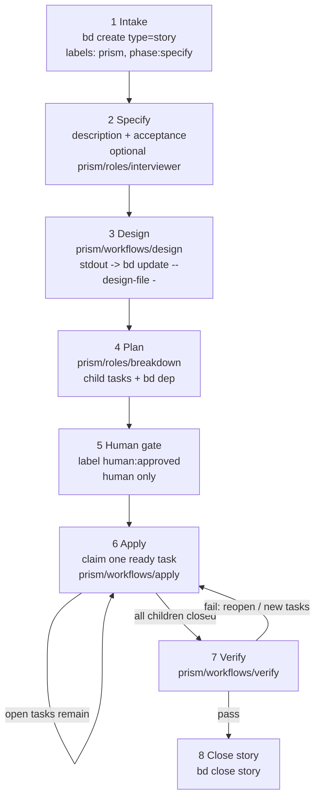

# Prism lifecycle graph

Canonical phase flow for the Prism story lifecycle. Durable state lives in
**beads**; agent runs are **Callee** IDs under `prism/*`. The host skill advances
**one phase at a time**.

## Graph

Workflow diagrams for the Prism lifecycle must remain **vertical** and **top-to-bottom**. Use Mermaid `flowchart TB` when editing this lifecycle documentation.



## Phase labels on the story

| After step | Typical labels |
| --- | --- |
| Intake / specify | `prism`, `phase:specify` → then `phase:design` |
| Design | `prism`, `phase:plan` (design field set) |
| Plan | `prism`, `phase:human` (children exist) |
| Human gate | `prism`, `phase:apply`, `human:approved` |
| Apply (in progress) | `prism`, `phase:apply`, `human:approved` |
| Verify | `prism`, `phase:verify`, `human:approved` |
| Done | story `closed` |

Prefer the **highest** `phase:*` present; if labels and artifacts disagree, trust artifacts (design field, children, `human:approved`). A story is ready for verify when it is `human:approved` and has no open child tasks.

## Callee agents per phase

| Step | Callee | Beads writes |
| --- | --- | --- |
| Specify assist | `prism/roles/interviewer` | `bd update` description / acceptance |
| Design | `prism/workflows/design` | stdout markdown piped to `bd update --design-file -` |
| Plan | `prism/roles/breakdown` | `bd create --parent`, `bd dep` — see [breakdown.md](breakdown.md) |
| Apply | `prism/workflows/apply` | claim / close one ready child task of the current story |
| Verify | `prism/workflows/verify` | close story only on pass; otherwise reopen or create follow-up tasks |

PromptKit template map: [promptkit.md](promptkit.md).

## Authority boundaries

```text
Human ──human:approved──► apply / verify consent for this story
Host skill ──bd──► durable state
Callee ──prism/*──► provider work (stateless between runs)
```

- Do **not** run apply without `human:approved`.
- During apply, claim only a ready child of the current story; do not pick from global `bd ready` alone.
- Do **not** close the story while child tasks are open.
- Do **not** close the story after verify if that run produced follow-up work.
- After each Callee return: persist with `bd`, then `bd show` / `bd children` / `bd ready`.
