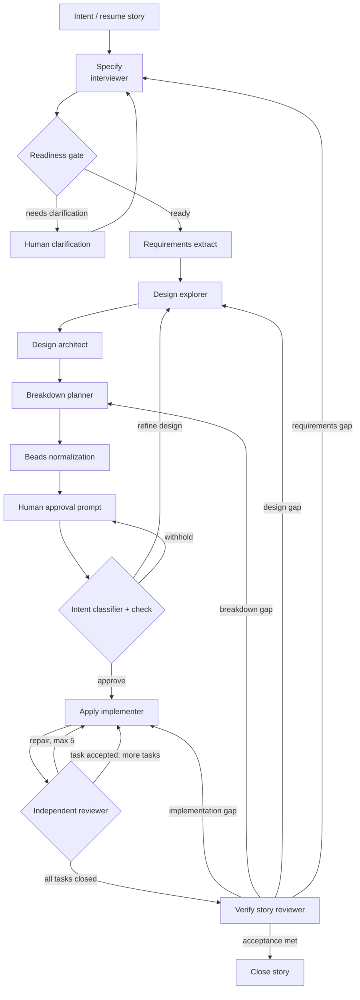

# Prism full story lifecycle graph

The host executes the same logical phase and role order as the digest-locked Prism
Callee workflow without invoking `callee`. Beads is the durable state store.

## State invariants

- Exactly one supported `phase:story:*` label exists on every active story.
- Unsupported phase labels are treated as absent and never migrated.
- A story with no supported phase starts at `phase:story:specify` without approval.
- Specify and Apply loops fail closed after five unsuccessful iterations.
- Human approval is distinct from Specify clarification.
- Design is explorer evidence followed by architect decisions.
- Apply review is based on the actual working tree and tests, not only worker output.
- Verify makes a close-or-bounce decision and performs no repairs.
- `pack/callee/**` is never modified by host execution.
