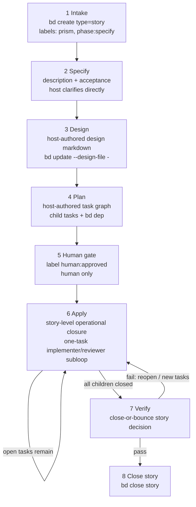

# Prism lifecycle graph

Canonical phase flow for the Prism story lifecycle. Durable state lives in
**beads**; the manual Prism skill advances **one phase at a time directly in the
host**. The separate `$prism-callee:lifecycle` skill may automate the same flow
through `prism/*` Callee assets.

## Graph

Workflow diagrams for the Prism lifecycle must remain **vertical** and **top-to-bottom**. Use Mermaid `flowchart TB` when editing this lifecycle documentation.



## Phase labels on the story

| After step | Typical labels |
| --- | --- |
| Intake / specify | `prism`, `phase:specify` → then `phase:design` |
| Design | `prism`, `phase:plan` (design field set) |
| Plan | `prism`, `phase:human` (children exist) |
| Human gate | `prism`, `phase:apply`, `human:approved` |
| Apply (in progress) | `prism`, `phase:apply`, `human:approved` |
| Verify | `prism`, `phase:verify`, `human:approved` |
| Done | story `closed` |

Prefer the **highest** `phase:*` present; if labels and artifacts disagree, trust artifacts (design field, children, `human:approved`). A story is ready for verify when it is `human:approved` and has no open child tasks.

## Host actions per phase

| Step | Host action | Beads writes |
| --- | --- | --- |
| Specify | Ask clarifying questions directly in chat, then refine story description and acceptance | `bd update` description / acceptance |
| Design | Inspect the repository and author design markdown directly in the host | `bd update --design-file -` |
| Plan | Break the story into 3–12 child tasks and dependencies; see [breakdown.md](breakdown.md) | `bd create --parent`, `bd dep` |
| Apply | Drive story-level operational closure one ready child at a time through the implementer/reviewer subloop until no ready work remains | child assignee moves between `prism/implementer` and `prism/reviewer`; story stays `phase:apply` |
| Verify | Make the close-or-bounce story decision against description, acceptance, and design | close story only on pass; otherwise reopen or create follow-up tasks |

`$prism-callee:lifecycle` reuses the same Beads labels and artifacts, but it is
the only skill that may execute `prism/*` Callee assets.

## Authority boundaries

```text
Human ──human:approved──► apply / verify consent for this story
Manual Prism skill ──bd + host work──► durable state + repo changes
Prism Callee skill ──prism/*──► provider work (stateless between runs)
```

- Do **not** run apply without `human:approved`.
- Do **not** invoke `callee agent run prism/...` from the manual `$prism:*` skills.
- During apply, claim only a ready child of the current story; do not pick from global `bd ready` alone.
- Beads assignee is the current phase owner: `prism/interviewer`, `prism/designer`, `prism/planner`, `human`, `prism/implementer`, `prism/reviewer`.
- Apply is story-level operational closure through the one-task implementer/reviewer loop.
- Verify is a close-or-bounce story decision.
- Do **not** close the story while child tasks are open.
- Do **not** close the story after verify if that run produced follow-up work.
- After each manual phase step: persist with `bd`, then `bd show` / `bd children` / `bd ready`.
