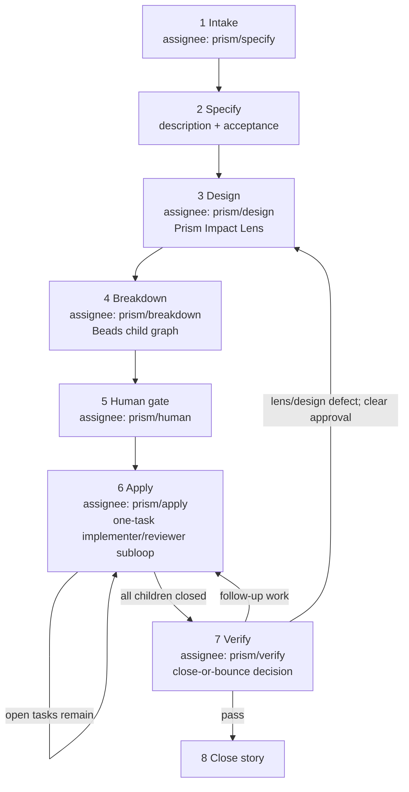

# Prism lifecycle graph

Lifecycle starts from user intent. It uses an explicitly named story ID when
present, otherwise resumes exactly one open Prism story; if neither applies, it
creates a new story assigned to `prism/specify`. The story assignee is the
durable lifecycle state. Beads labels contain only
`prism` membership and, after approval, `human:approved`. The manual Prism skill
advances one phase directly in the host; `$prism-callee:lifecycle` automates the
same assignee graph through `prism/*` Callee assets.

## Graph

Keep workflow diagrams vertical and top-to-bottom.



## Story state

| Step | Story assignee | Labels |
| --- | --- | --- |
| Intake / specify | `prism/specify` | `prism` |
| Design | `prism/design` | `prism` |
| Breakdown | `prism/breakdown` | `prism` |
| Human gate | `prism/human` | `prism` |
| Apply | `prism/apply` | `prism`, `human:approved` |
| Verify | `prism/verify` | `prism`, `human:approved` |
| Done | closed | unchanged |

Derive phase from the story assignee. Reconcile it with requirements, design,
children, and approval rather than adding a phase label.

For any open legacy story whose design lacks a complete Impact Lens, clear
`human:approved`, return it to Design, preserve all children, then reconcile the
child graph in Breakdown. Closed stories remain unchanged.

## Host actions per phase

| Step | Host action | Beads writes |
| --- | --- | --- |
| Specify | Clarify directly in chat and refine story requirements | description, acceptance, `prism/design` |
| Design | Inspect repository; write design and five-dimension Impact Lens | design, `prism/breakdown` |
| Breakdown | Create or reconcile children; cover every actionable mitigation | children, dependencies, `prism/human` |
| Human | Show Design summary → Impact Lens → Task summary → Approval request | `human:approved`, `prism/apply` only after unambiguous free-form approval |
| Apply | Close ready children through the inner loop | task `prism/apply/implementer` → `prism/apply/reviewer`; story stays `prism/apply` |
| Verify | Make the close-or-bounce decision | close story or return it to the needed assignee |

## Authority boundaries

```text
Human ──human:approved──► prism/apply / prism/verify consent
Manual Prism skill ──bd + host work──► durable state + repo changes
Prism Callee skill ──prism/*──► provider work
```

- Do not run apply without `human:approved`.
- Do not invoke `callee agent run prism/...` from the manual `$prism:*` skills.
- During apply, claim only a ready child of the current story.
- Verify is a close-or-bounce story decision; do not close the story with open children or follow-up work.
